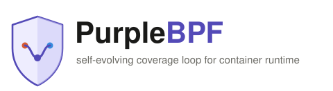
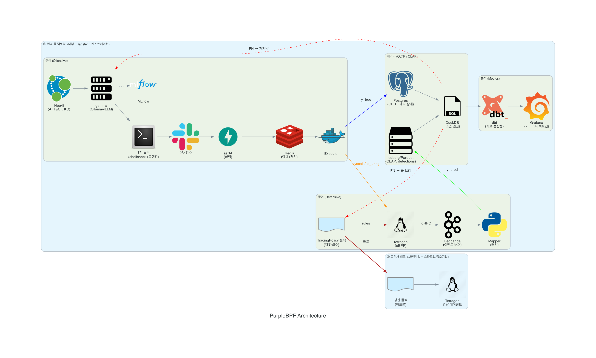

<p align="center">
  
</p>

<p align="center">
  <em>self-evolving coverage loop for container runtime</em>
</p>

# PurpleBPF

*a self-evolving coverage loop for container runtime*

> **PurpleBPF**라는 이름은 red(공격)와 blue(방어)를 합친 purple, 그리고 커널 관측·제어 기술인 **eBPF**를 결합해 만들었다. 공격과 방어가 하나의 루프 안에서 서로를 검증하고 보강하는 시스템이라는 정체성을 담은 이름이다.

## 아키텍처



## 개요 (What & Why)

PurpleBPF는 공격을 자동으로 생성해 실제 커널에서 실행하고, 방어 시스템이 이를 얼마나 탐지하는지 측정한 뒤, 놓친 부분(False Negative)만 골라 다시 공격을 겨냥하는 **폐쇄 루프(closed loop)** 시스템이다.

- **ground truth를 아는 공격자**를 두어 재현율(recall)을 정확히 계산하고, 탐지 사각지대를 스스로 메운다.
- 핵심 아이디어는 **"생성이 곧 라벨"**이다. 공격을 직접 생성하고 실행하기 때문에 무엇을 쐈는지에 대한 정답을 라벨링 비용 0으로 확보한다.
- 타깃은 별도의 보안 전문팀이 없는 **1인 스타트업·중소기업**이다. 이들의 클라우드 네이티브 전환이 활발하다는 점에 착안해 클라우드 전술에 집중한다.
- 겨냥하는 3개 축은 다음과 같다.

| 축 | 내용 |
|---|---|
| T1611 | 컨테이너 탈출(Escape to Host) |
| T1548 | 권한 상승(Abuse Elevation Control Mechanism) |
| io_uring | syscall 후킹 우회 회피 채널 |

## 핵심 루프

PurpleBPF는 다음 순서로 하나의 루프를 순환한다.

```
1. ATT&CK 지식그래프 기반 GraphRAG + gemma가 공격 체인 생성
        │
        ▼
2. 1차 필터(문법·순서 검증) + Slack 2차 검수
        │
        ▼
3. Executor가 실제 컨테이너에서 syscall 실행 (y_true)
        │
        ▼
4. Tetragon이 독립적으로 탐지 (y_pred)
        │
        ▼
5. 실행로그 ⋈ detections 조인으로 TP / FN / FP 계산
        │
        ▼
6. FN(놓친 것)을 GraphRAG 목표로 재투입 + 재우·희수가 룰 보강
        │
        └──────────────► (1로 순환)
```

이 루프는 "공격을 쐈는데 방어가 놓친 지점"을 자동으로 찾아내고, 그 지점을 다음 세대 공격 생성의 목표로 삼아 커버리지를 스스로 넓혀간다.

## 기술 스택

| 구분 | 단계 | 툴 | 역할 |
|---|---|---|---|
| 생성 (Offensive) | 지식그래프 | Neo4j | ATT&CK 기반 공격 체인 그래프 저장·질의 |
| 생성 (Offensive) | 생성 모델 | gemma (Ollama/vLLM) | GraphRAG 기반 공격 체인 생성 |
| 생성 (Offensive) | 실험 관리 | MLflow | 생성 모델 실험·버전 추적 |
| 생성 (Offensive) | 1차 필터 | shellcheck + Python 룰엔진 | 문법·순서 검증 |
| 생성 (Offensive) | 2차 검수 | Slack + FastAPI | 사람 승인 워크플로 |
| 생성 (Offensive) | 잡큐 | Redis | 실행 대기열 관리 |
| 경계 | 실행 채널 | syscall / io_uring | 공격 실행 및 탐지 우회 경로 |
| 방어 (Defensive) | 탐지 | Tetragon + gRPC | 커널 이벤트 독립 탐지 |
| 방어 (Defensive) | 이벤트 버퍼 | Redpanda | 탐지 이벤트 스트리밍 버퍼 |
| 방어 (Defensive) | 매핑 | Mapper | 탐지 이벤트 ↔ 실행 로그 매핑 |
| 데이터 | OLTP | PostgreSQL | 트랜잭션성 데이터 저장 |
| 데이터 | OLAP | Parquet + Iceberg | 분석용 레이크하우스 |
| 데이터 | 조인 엔진 | DuckDB | TP/FN/FP 계산용 조인 처리 |
| 분석 | 변환 | dbt | 데이터 모델링·변환 |
| 분석 | 시각화 | Grafana | 커버리지·탐지율 대시보드 |
| 오케스트레이션 | 파이프라인 | Dagster | 루프 전체 스케줄링·오케스트레이션 |

## ⚠️ 협업 규칙

> **🚫 main 브랜치에 직접 push하는 것을 절대 금지한다.**
>
> **✅ 모든 작업은 반드시 별도 브랜치를 파서 진행하고, Pull Request로만 병합한다.**

**예시 흐름**

```bash
git checkout -b feature/작업명
# 작업 진행
git push origin feature/작업명
# PR 생성 → 리뷰 → 병합
```

**브랜치 네이밍 규칙**

| 접두사 | 용도 |
|---|---|
| `feature/기능명` | 새로운 기능 개발 |
| `fix/버그명` | 버그 수정 |

## 디렉토리 구조

```
PurpleBPF/
├── src/purplebpf/     # 핵심 파이썬 패키지 (offensive, defensive, data, queue, common)
├── rules/              # Tetragon TracingPolicy 등 탐지 룰 정의
├── dbt/                # staging/intermediate/marts 데이터 변환 모델
├── orchestration/      # Dagster 에셋·센서 정의
├── infra/              # compose, grafana, redpanda, terraform 등 인프라 설정
└── architecture_logo/       # 아키텍처 다이어그램 소스와 이미지
```
