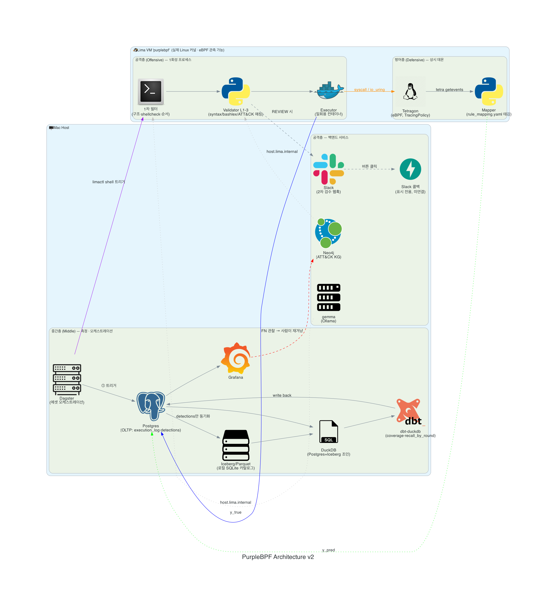
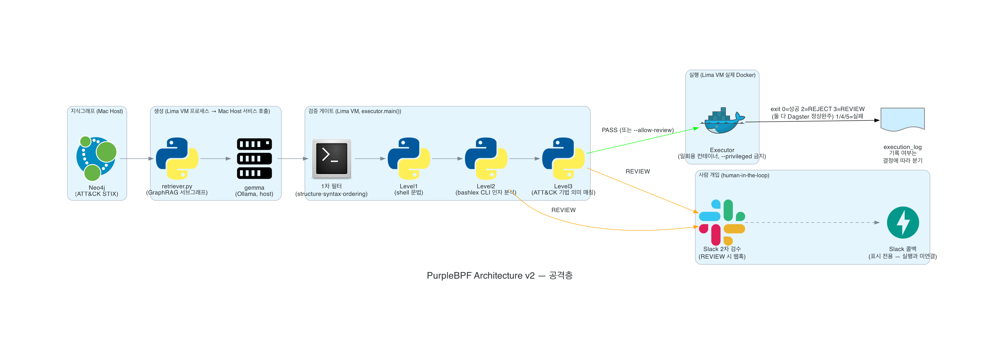
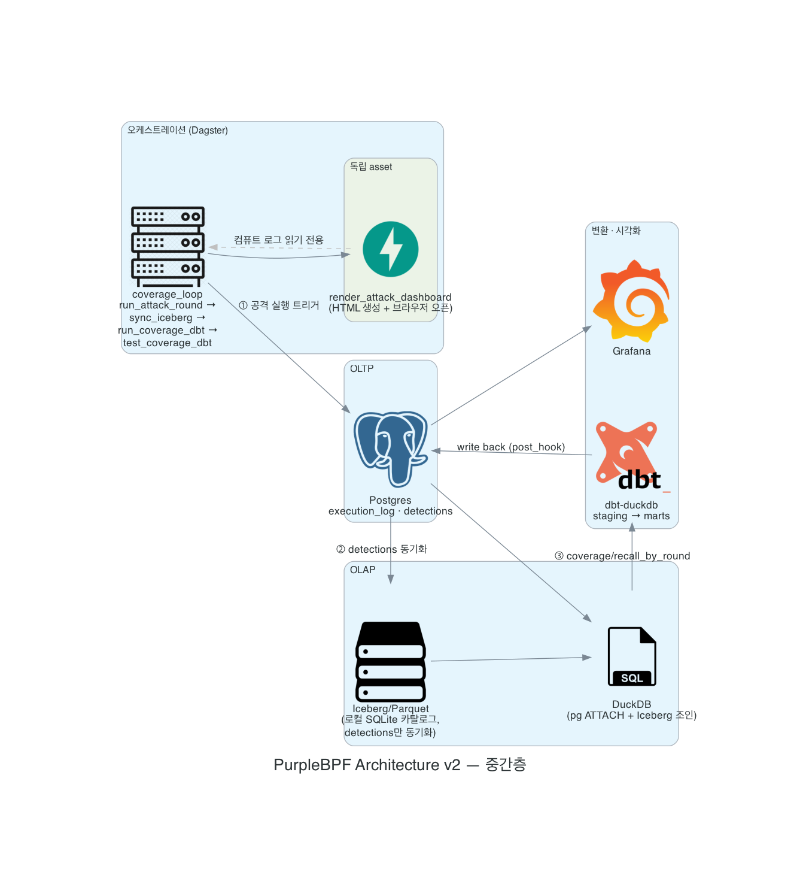
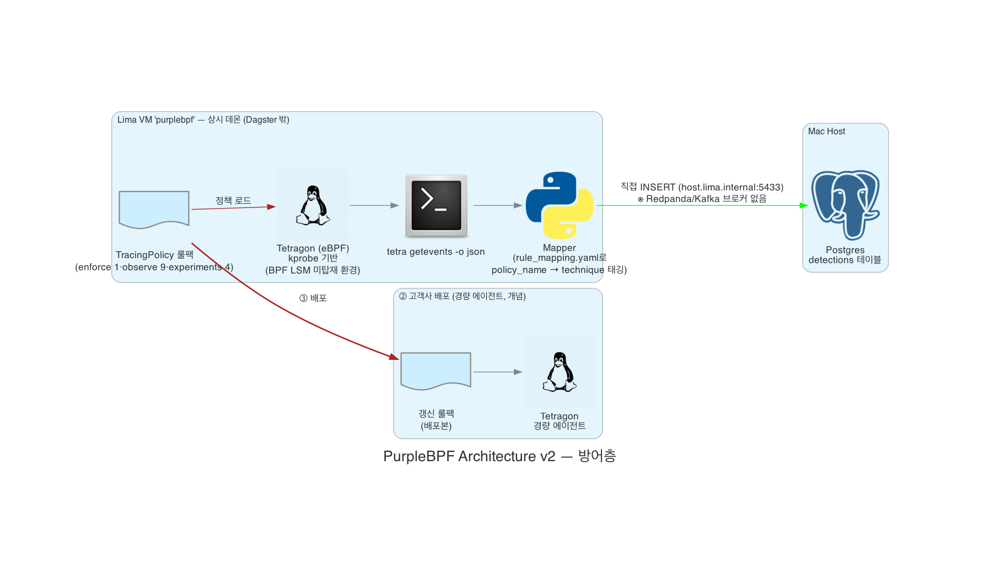

<p align="center">
  
</p>

```
┌──────────────────────────────────────────────────────────────────────┐
│ root@purplebpf:~$ whoami                                             │
│ > self-evolving coverage loop for container runtime                  │
│                                                                        │
│ [ RED × BLUE = PURPLE ]   [ eBPF-POWERED ]   [ CLOSED LOOP ]         │
└──────────────────────────────────────────────────────────────────────┘
```


---

## [ 0x00 ] 프로젝트 개요

**PurpleBPF**라는 이름은 red(공격)와 blue(방어)를 합친 purple, 그리고 커널을 직접 관측·제어하는 기술인 **eBPF**를 결합해 지었다. 공격과 방어가 하나의 루프 안에 갇혀 서로를 검증하고 서로를 보강하는 시스템이라는 정체성을 이름 자체에 담았다.

> 탐지 도구는 자기가 무엇을 놓치고 있는지 스스로 알지 못한다.

이것이 이 프로젝트가 출발한 문제의식이다. PurpleBPF는 공격을 스스로 생성해 실제 커널 위에서 실행하고, 방어 시스템(Tetragon)이 그 공격을 얼마나 탐지하는지 측정한 뒤, 탐지가 비어 있는 지점(False Negative)만 골라 다음 라운드의 공격 목표로 되먹인다. 사람이 매번 시나리오를 짜지 않아도, 시스템이 자신의 사각지대를 스스로 좁혀나가는 **폐쇄 루프(closed loop)** 다.

- **핵심 아이디어 — "생성이 곧 라벨".** 공격을 직접 생성하고 직접 실행하기 때문에, 무엇을 쐈는지에 대한 정답(ground truth)을 라벨링 비용 0으로 확보한다. 탐지 여부는 그 정답과 대조하기만 하면 된다.
- **타깃은 보안 전문팀이 없는 1인 스타트업·중소기업이다.** 이들의 클라우드 네이티브 전환이 활발하다는 점에 착안해, 컨테이너 런타임을 노리는 전술에 화력을 집중한다.
- **겨냥하는 축은 세 가지다.**

| 축 | ATT&CK 기법 | 내용 |
|---|---|---|
| 컨테이너 탈출 | T1611 | Escape to Host — 호스트 네임스페이스/파일시스템 침투 |
| 권한 상승 | T1548 | Abuse Elevation Control Mechanism — setuid/setgid 등 악용 |
| 탐지 우회 채널 | io_uring | syscall 진입점 후킹을 우회하는 비동기 I/O 경로 |

---

## [ 0x01 ] 아키텍처

전체 파이프라인은 **공격층(Offensive) · 방어층(Defensive) · 중간층(Middle, 측정·오케스트레이션)** 세 층으로 나뉜다. 공격층의 실행 프로세스(1차 필터 → Validator → Executor)와 방어층(Tetragon·Mapper)은 **Lima VM** 안에서 돌고, 중간층(Postgres·Iceberg·DuckDB·dbt·Grafana·Dagster)은 **Mac Host**에서 돈다.



<details>
<summary><strong>층별 상세 다이어그램 펼치기 (공격층 / 중간층 / 방어층)</strong></summary>

**공격층 (Offensive)** — Neo4j 지식그래프 → gemma 생성 → 1차 필터 → Validator L1-3 → (REVIEW 판정 시 Slack 2차 검수) → Executor



**중간층 (Middle) — 측정 · 오케스트레이션** — Dagster가 트리거하면 Postgres(execution_log·detections) → Iceberg 동기화 → DuckDB 조인 → dbt(coverage·recall_by_round) → Grafana



**방어층 (Defensive)** — Tetragon(eBPF, TracingPolicy) → Mapper가 Postgres에 직접 기록 (중간 브로커 없음)



</details>

---

## [ 0x02 ] 아키텍처 설명

### 왜 Lima VM인가

Docker Desktop만으로는 이 프로젝트가 성립하지 않는다. Tetragon은 eBPF로 커널의 syscall 진입점에 직접 훅을 건다. Docker Desktop은 macOS 위에 경량 Linux VM을 감춰두고 컨테이너만 노출하는 구조라, 그 안에서 eBPF 프로그램을 원하는 방식으로 붙일 수 없다. 그래서 **Lima**로 진짜 Linux 커널을 macOS 위에 띄우고, Executor·Mapper·Tetragon을 전부 그 안에서 돌린다. 검증된 실행 환경은 Ubuntu 26.04 / 커널 7.0.0 / aarch64 / Tetragon v1.7.0이다.

### 핵심 루프

```
1. ATT&CK 지식그래프 기반 GraphRAG + gemma가 공격 체인을 생성한다
        │
        ▼
2. 1차 필터(구조·shellcheck·순서) → Validator L1-3(문법 / CLI 인자 / ATT&CK 기법 매칭)
   → REVIEW 판정 시 Slack으로 2차 검수 요청이 나간다
        │
        ▼
3. Executor가 Lima VM의 실제 컨테이너에서 syscall을 실행한다 (y_true)
        │
        ▼
4. Tetragon이 독립적으로 탐지하고, Mapper가 Postgres에 직접 기록한다 (y_pred)
        │
        ▼
5. DuckDB가 실행로그 ⋈ detections를 조인하고, dbt가 TP / FN / invalid를 계산한다
        │
        ▼
6. 사람이 FN(놓친 지점)을 관찰해 다음 GraphRAG 목표로 재겨냥하고, 검수 담당이 룰을 보강한다
        │
        └──────────────► (1로 순환)
```

1~5는 Dagster(`coverage_loop`)가 사람 개입 없이 라운드마다 자동으로 돈다. 6의 재겨냥·룰 보강은 현재 사람이 Grafana와 대시보드를 보고 판단한다 — 이 지점을 완전 자동 루프로 닫는 것이 다음 로드맵이다.

### 판정은 여섯 개의 종료코드로 압축된다

Executor는 1차 필터와 3단계 Validator를 통과한 체인만 실행하고, 그 결과 전체를 종료코드 하나로 요약한다. Dagster는 이 코드를 보고 "방어가 정상 작동했다"(0/2/3)와 "시스템이 고장났다"(1/4/5)를 구분해서, 전자는 파이프라인을 초록불로 완주시키고 후자만 실패로 처리한다.

| 코드 | 의미 |
|---|---|
| 0 | 성공 — 검증 통과, 실행까지 완료 |
| 1 | 실행 실패 — 통과는 했으나 컨테이너 안에서 스텝이 실패 |
| 2 | REJECT — 1차 필터/Validator가 구조적으로 반려 |
| 3 | REVIEW — 사람 검수 필요, 기본적으로 실행 차단 |
| 4 | 시스템 오류 — 검증기 자체 오류 |
| 5 | 입력 오류 — 체인 파일 파싱 실패 등 |

### 2차 검수 — 현재까지 구현된 것과 다음 단계

REVIEW로 판정된 체인은 Slack Block Kit 메시지로 실시간 통지된다(승인/반려 버튼 UI 포함). **여기까지는 실제로 동작하는 부분이다.** "승인 버튼을 누르면 그 체인이 자동으로 재실행되는 고리"는 다음 스프린트의 작업 대상으로 남아 있다 — 지금은 검수자가 승인 의사를 확인한 뒤 `--allow-review` 플래그로 직접 실행을 트리거하는 수동 단계가 그 사이에 있다.

---

## [ 0x03 ] 주요 코드

### Mapper — 커널 이벤트 하나를 ATT&CK 기법으로 번역한다

TracingPolicy 없이도 Tetragon의 기본 `process_exec` 스트림만으로 판정하는 규칙이 있다. "웹 서버가 셸을 자식으로 띄운다"는 이상 징후(anomalous-shell-spawn, T1059.004)가 그 예다.

```python
# src/purplebpf/defensive/mapper/mapper.py
def _match_stream_rules(body: dict, stream_rules: dict) -> tuple[str | None, str | None]:
    """process.binary가 shell_binaries에 전체경로로 완전일치하고, parent.binary가
    parent_contains 중 하나를 부분문자열로 포함하면 해당 technique으로 본다."""
    rule = stream_rules.get("anomalous-shell-spawn")
    ...
    if process_binary not in shell_binaries:
        return None, None
    if not any(server in parent_binary for server in parent_contains):
        return None, None
    return "anomalous-shell-spawn", rule.get("technique")
```

### coverage.sql — TP와 FN을 가르는 기준

실행 로그와 탐지 로그를 그냥 시간순으로 이어 붙이면 안 된다. 컨테이너 ID 길이가 시스템마다 다르고(Executor는 short id 12자리, Tetragon은 31자리), `success=false`(차단된 시도)를 미탐으로 잘못 세면 다음 라운드 생성 목표가 오염된다.

```sql
-- dbt/models/marts/coverage.sql
LEFT JOIN {{ ref('stg_detections') }} d
  ON  d.technique = e.technique
  AND d.container_id LIKE e.container_id || '%'          -- 접두사 조인
  AND (d.detected_at AT TIME ZONE 'UTC') >= e.started_at
  AND (d.detected_at AT TIME ZONE 'UTC')
      <= e.finished_at + INTERVAL {{ eps }} SECOND        -- 이벤트 파이프라인 지연 흡수
```

`success=false`(REVIEW/REJECT로 차단된 시도)는 이 조인에서 아예 `INVALID`로 분리되어, 실행되지도 않은 공격이 가짜 미탐(FN)으로 되먹여지는 것을 막는다.

더 많은 코드는 [`orchestration/`](orchestration/)(Dagster 파이프라인), [`src/purplebpf/offensive/validator/`](src/purplebpf/offensive/validator/)(3단계 검증기), [`rules/`](rules/)(TracingPolicy 룰팩)에서 확인할 수 있다.

---

## [ 0x04 ] 클론 후 지침

### 요구 사항

| 구분 | 요구 사항 |
|---|---|
| OS | **macOS (Apple Silicon 검증됨)**. Lima 자체가 macOS 전용 가상화 도구라 **Windows는 지원되지 않는다** — 이 저장소에 Windows용 정식 셋업 가이드는 없다 |
| 가상화 | [Lima](https://github.com/lima-vm/lima) — Docker Desktop으로는 eBPF 관측이 안 되므로 대체 불가 |
| 컨테이너 | Docker (Postgres·Neo4j·Grafana는 `docker compose`, 공격 실행은 Lima VM 안의 Docker) |
| LLM | [Ollama](https://ollama.com) + `gemma2:2b` 로컬 서빙 |
| 언어 | Python ≥ 3.10 (Host와 VM 양쪽 모두 필요 — **동일한 환경이 아니다**, 아래 참고) |

### 설치 순서

```bash
# 1. 클론 & 파이썬 의존성
git clone <repo-url> && cd PurpleBPF
python3 -m venv .venv && source .venv/bin/activate
pip install -e .

# 2. 환경변수
cp .env.example .env
# .env를 열어 DATABASE_URL / NEO4J_AUTH / SLACK_WEBHOOK_URL 등을 채운다

# 3. 인프라 컨테이너 (Postgres · Neo4j · Grafana)
docker compose up -d

# 4. DB 마이그레이션
alembic upgrade head

# 5. ATT&CK 지식그래프 적재 (Neo4j)
python3 -m purplebpf.offensive.kg.download_stix
python3 -m purplebpf.offensive.kg.load_graph

# 6. Ollama 모델 준비
ollama pull gemma2:2b

# 7. Lima VM (별도 셋업 필요 — limactl로 Ubuntu 인스턴스 생성 후
#    그 안에 Docker · Tetragon(eBPF) · shellcheck · bashlex를 설치)
limactl start --name=purplebpf <lima-config>

# 8. Dagster 오케스트레이션 기동
dagster dev -f orchestration/definitions.py
```

### 클론한 사람이 반드시 알아야 할 것

- **Host 파이썬 환경과 VM 파이썬 환경은 서로 다르다.** `bashlex`(Level2 검증기가 씀)와 `shellcheck`(1차 필터가 씀)는 **VM 안에만** 있으면 된다 — Host venv에 없어도 정상이다. 반대로 실행/탐지(Executor, Mapper, Tetragon)는 전부 VM 안에서만 돈다.
- **`docker compose` 명령이 이상한 소켓을 보는 경우가 있다.** 로컬에 `DOCKER_HOST`가 다른 값으로 오염돼 있으면 `docker compose ...` 앞에 `DOCKER_HOST=`를 붙여 우회한다. (`.env.example`의 `DOCKER_HOST` 주석 참고)
- **기본 타깃 기법(`TARGET_TECHNIQUE_ID`, 기본값 T1059.004)은 Level3 검증 규칙이 아직 없다.** 즉 gemma 자유생성으로는 이 기법에서 `decision=PASS`가 **구조적으로 나올 수 없다**(REVIEW/REJECT까지만 간다 — 이건 버그가 아니라 아직 그 기법의 규칙을 안 만든 것). 실제로 실행까지 이어지는 걸 보고 싶다면 `PBPF_TARGET_TECHNIQUE=T1548.001`로 바꾸거나, 검증된 시나리오인 `rules/seed_chains/t1548_001_setuid_privesc.json`을 `--chain-file`로 직접 넘긴다.
- **Slack 2차 검수는 알림까지만 동작한다.** 승인 버튼을 눌러도 자동으로 실행되지 않는다 — `--allow-review` 플래그로 수동 승인해야 한다([ 0x02 ] 참고).
- **Dagster의 코드서버(gRPC) 프로세스는 가끔 죽는다.** UI에서 `DagsterUserCodeUnreachableError`가 뜨면 `dagster dev` 전체를 재시작하면 해결된다.
- **`.env`는 절대 커밋하지 않는다.** `.env.example`만 커밋 대상이다.

---

## [ 0x05 ] 팀원

4인 팀이 파이프라인을 두 축으로 나눠 맡는다.

| 담당 영역 | 역할 |
|---|---|
| 공격 생성 · 실행 · 인프라 | 지식그래프/GraphRAG 기반 체인 생성, Executor, Mapper·DB·인프라 구축 |
| 검수 · 탐지 규칙 | 2차 사람 검수 프로세스 설계, TracingPolicy 룰팩 작성 |

---

## ⚠️ 협업 규칙

> **🚫 main 브랜치에 직접 push하는 것을 절대 금지한다.**
>
> **✅ 모든 작업은 반드시 별도 브랜치를 파서 진행하고, Pull Request로만 병합한다.**

```bash
git checkout -b feature/작업명
# 작업 진행
git push origin feature/작업명
# PR 생성 → 리뷰 → 병합
```

| 접두사 | 용도 |
|---|---|
| `feature/기능명` | 새로운 기능 개발 |
| `fix/버그명` | 버그 수정 |

## 디렉토리 구조

```
PurpleBPF/
├── src/purplebpf/      # 핵심 파이썬 패키지
│   ├── offensive/      #   generation(GraphRAG) · filter(1차 필터) · validator(L1-3) · executor · review(Slack)
│   ├── defensive/      #   mapper (Tetragon 이벤트 → Postgres 직접 기록)
│   ├── analysis/       #   iceberg_setup, coverage_duckdb, dbt 플러그인
│   └── common/         #   설정/DB 커넥션 헬퍼
├── rules/              # Tetragon TracingPolicy(enforce/observe/experiments) · rule_mapping.yaml · seed_chains
├── dbt/                # staging/intermediate/marts 데이터 변환 모델
├── orchestration/      # Dagster 에셋 정의 (coverage_loop, chain_dashboard)
├── infra/              # compose(postgres·neo4j·grafana), terraform 등 인프라 설정
└── architecture_logo/  # 아키텍처 다이어그램 소스와 이미지
```

```
┌──────────────────────────────────────────────────────────────────────┐
│ root@purplebpf:~$ _                                                  │
└──────────────────────────────────────────────────────────────────────┘
```
