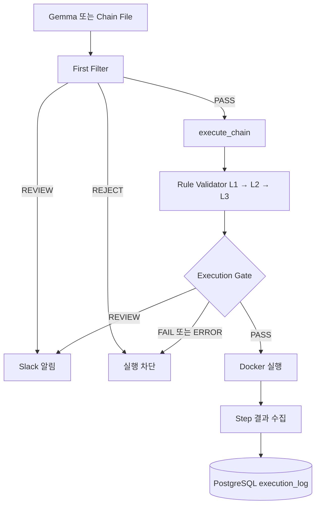

# Rule Validator–Executor 통합

## 1. 문서 목적

LLM이 생성하거나 파일에서 읽은 공격 Scenario는 문법상 올바르더라도 지원하지 않는
명령·옵션을 포함하거나, 명령 사이의 자원 관계가 맞지 않거나, 목표 ATT&CK Technique과
행동이 일치하지 않을 수 있다. 이런 Scenario가 곧바로 Executor에 전달되면 검토가 필요한
명령도 실제 Docker 컨테이너에서 실행될 수 있다.

Rule Validator 통합의 목적은 실제 실행 직전에 Level 1~3 결과를 하나의 fail-closed
Gate로 집계하여, 전체 검증이 명확하게 통과한 Scenario만 실행하는 것이다. 이 문서는 현재
Branch의 구현을 기준으로 통합 위치, 판정 정책, Slack·Docker·PostgreSQL 처리, 입력
경로와 검증 범위를 설명한다. Rule 정확도 자체의 평가나 승인 Workflow 구현은 범위에
포함하지 않는다.

관련 구현은 다음 파일에 있다.

- [Executor와 Execution Gate](../../executor/executor.py)
- [Rule Validator 파이프라인](../main.py)
- [First Filter](../../filter/first_filter.py)
- [Slack REVIEW 알림](../../review/slack_notify.py)

## 2. 통합 전·후 흐름

### 통합 전

```text
Scenario 생성·로드
→ First Filter
→ Executor
```

### 통합 후

```text
Scenario 생성·로드
→ First Filter
→ execute_chain()
→ Rule Validator L1 → L2 → L3
→ Execution Gate
   ├─ PASS   → Docker 실행
   ├─ REVIEW → 실행 보류 + Slack 알림
   ├─ FAIL   → 실행 차단
   └─ ERROR  → fail-closed 실행 차단
```

First Filter를 통과했다는 사실만으로 실행되지는 않는다. `execute_chain()`이 Rule
Validator의 전체 결과를 다시 확인하고, 모든 필수 상태가 `PASS`일 때만 기존 Docker 실행
경로로 진입한다.

## 3. 전체 처리 흐름



REVIEW에서 Docker로 이어지는 경로는 없다. PostgreSQL에는 Gate 판정 자체가 아니라
Docker 실행 경로가 반환한 실행 결과만 기록된다.

## 4. 통합 위치

최종 Gate는
[`purplebpf.offensive.executor.executor.execute_chain()`](../../executor/executor.py)에
있다. 함수 진입 직후 `_validate_execution_gate(chain)`이
`validate_scenario_pipeline(chain)`을 호출한다. Gate가 `PASS`를 반환한 뒤에야
`docker.from_env()`와 `docker_client.containers.run()`이 호출된다.

이 위치를 실행 경계로 삼은 결과는 다음과 같다.

- Executor CLI는 First Filter 통과 후 `execute_chain()`을 호출하므로 두 Gate를 모두 지난다.
- 다른 Python 코드가 `execute_chain(chain)`을 직접 호출해 First Filter를 우회하더라도 Rule
  Validator는 우회할 수 없다.
- Dagster와 Demo는 Executor CLI를 호출하므로 동일한 Gate를 사용한다.
- `_run_step()` 같은 private 함수를 의도적으로 직접 호출하는 것은 정상 실행 경계 밖이다.

Validator를 Generator 안에 두지 않은 이유는 Chain File처럼 생성기를 거치지 않는 입력도
동일하게 보호해야 하기 때문이다. `executor.main()`에만 두지 않은 이유는 직접 함수 호출이
CLI를 우회할 수 있기 때문이다. 실행 책임을 가진 `execute_chain()` 내부에 Gate를 두면
Docker 생성이라는 부작용 바로 앞에서 모든 정상 호출 경로를 통제할 수 있다.

## 5. 구성요소별 책임

| 구성요소 | 책임 | 실행 여부 결정 |
| --- | --- | --- |
| Gemma Generator | Neo4j subgraph와 prompt를 사용해 Scenario 생성 | X |
| First Filter | 필수 구조, ShellCheck 문법, 기본 명령 순서 검사 | 1차 Gate |
| Rule Validator L1 | 각 Step의 Shell 문법 검사 | X |
| Rule Validator L2 | 명령·옵션, 자원, 의미 Fact와 Chain 의존성 검사 | X |
| Rule Validator L3 | Action과 Technique core pattern의 관계 검사 | X |
| Execution Gate | L1·L2·L3·final 상태를 보수적으로 집계 | 최종 실행 허용 |
| Executor | 격리된 Docker 컨테이너에서 Step 순차 실행 | Gate PASS만 |
| Slack | REVIEW 맥락 알림 | 실행 승인 기능 없음 |
| PostgreSQL | 실제 실행 결과를 `execution_log`에 저장 | 판정 기능 없음 |

First Filter와 Rule Validator는 중복되는 문법 검사를 일부 갖지만 목적이 다르다. First
Filter는 CLI 입력 경로에서 구조·기본 순서를 빠르게 거르는 1차 Gate다. Rule Validator는
지원 명령의 인자와 자원, 명령 간 관계, ATT&CK Technique 의미까지 단계적으로 검사하며,
직접 `execute_chain()` 호출에도 적용되는 최종 실행 Gate의 근거를 제공한다.

## 6. 판정 및 실행 정책

| 판정 | Docker 실행 | Slack REVIEW 알림 | `execution_log` | CLI Exit Code |
| --- | ---: | ---: | ---: | ---: |
| PASS 후 실행 성공 | O | X | O (`success=true`) | 0 |
| PASS 후 명령 실패 | O | X | O (`success=false`) | 1 |
| REVIEW | X | O, 미설정 시 `NOT_CONFIGURED` | X | 3 |
| FAIL/REJECT | X | X | X | 2 |
| ERROR | X | X | X | 4 |

잘못된 CLI 인자나 읽을 수 없거나 파싱할 수 없는 Chain File은 실행 전 입력 오류로 처리하고
Exit Code 5를 반환한다.

First Filter의 `REVIEW`와 `REJECT`는 `execute_chain()` 호출 전에 각각 Execution Gate의
`REVIEW`와 `FAIL` 의미로 정규화된다. First Filter가 `PASS`하면 `execute_chain()` 내부의
Rule Validator Gate가 실행된다. Validator 예외, 누락된 결과, 알 수 없는 상태는 `ERROR`로
fail-closed 처리한다.

## 7. Validator 결과 집계

Rule Validator 파이프라인의 실제 상태 계약은 다음과 같다.

- Level 1: `PASS` 또는 `FAIL`. `FAIL`이면 L2·L3를 실행하지 않고 final은 `REJECT`다.
- Level 2: `PASS`, `REVIEW`, `REJECT`. `REJECT`이면 L3를 실행하지 않는다.
- Level 3: `PASS`, `REVIEW`, `REJECT`.
- Validator final: `PASS`, `REVIEW`, `REJECT`.
- Execution Gate: `PASS`, `REVIEW`, `FAIL`, `ERROR`.

Level 2의 `REVIEW`는 Level 3 평가를 막지 않는다. 따라서 L2가 `REVIEW`이고 L3와
Validator final이 `PASS`인 결과도 가능하다. Execution Gate는 final만 신뢰하지 않고 모든
Level을 다시 보므로 이 경우 최종 `REVIEW`로 실행을 보류한다.

집계 의미는 다음 의사 코드와 같다.

```python
if result_shape_or_status_is_invalid:
    decision = "ERROR"
elif any_status_is_fail_or_reject:
    decision = "FAIL"
elif any_status_is_review:
    decision = "REVIEW"
elif all_required_statuses_are_pass:
    decision = "PASS"
else:
    decision = "ERROR"
```

실제 구현은 L1 또는 L2에서 정상적으로 조기 종료된 `REJECT` 형태만 허용하고, 서로 모순된
조합은 `VALIDATION_RESULT_INVALID`로 처리한다. Validator 호출 자체가 예외를 던지면
`VALIDATOR_ERROR`다.

## 8. Slack REVIEW 처리

Executor는 기존 `notify_review()` 전송 함수를 `notify_scenario_review()` 어댑터를 통해
재사용한다.

- First Filter REVIEW는 `executor.main()`에서 `source="FIRST_FILTER"`로 알린 뒤 실행을
  끝낸다.
- Rule Validator REVIEW는 `execute_chain()`에서 `source="RULE_VALIDATOR"`로 알린 뒤
  실행을 끝낸다.
- Validator 알림에는 REVIEW가 나온 Level, Reason code, 관련 Step과 잘린 Command가
  포함될 수 있다.
- First Filter가 REVIEW이면 Validator에 진입하지 않고, First Filter가 PASS인 경우에만
  Validator REVIEW가 발생하므로 한 요청에서 두 알림이 중복 전송되지 않는다.
- Webhook 미설정은 `NOT_CONFIGURED`, 전송 또는 준비 실패는 `FAILED`, 성공은 `SENT`다.
- Slack 미설정이나 전송 실패가 REVIEW를 PASS로 바꾸지 않는다. Docker는 계속 차단된다.

현재 Slack Block Kit에는 승인·반려 버튼이 표시되지만, 버튼 Callback, Review Queue,
승인 후 재실행 기능은 구현되어 있지 않다. 따라서 Slack은 알림 수단이지 실행 승인
시스템이 아니다.

## 9. Executor 및 DB 처리

### PASS

```text
Gate PASS
→ Docker Client 생성
→ ubuntu:22.04 일회용 Container 생성
→ order 기준 Step 순차 실행
→ 각 Exit Code와 제한된 Output 수집
→ 첫 비정상 Exit Code에서 중단
→ Container 제거
→ execution_log 저장
```

컨테이너는 privileged mode, host PID/network, host volume, 추가 capability 없이 생성된다.
각 명령에는 30초 timeout이 적용된다. 명령이 0이 아닌 Exit Code로 끝나면
`success=false`가 저장된다.

[`execution_log` Alembic revision](../../../../../db/migrations/versions/1effaa4894cb_create_execution_log.py)은
실행의 round, chain UUID, Technique, channel, 성공 여부, 시작·종료 시각과 container ID를
저장한다. Validation 결과 자체를 저장하는 열은 없다.

### REVIEW·FAIL·ERROR

```text
Docker Client 미생성
Container 미생성
Step 미실행
execution_log 미저장
```

Docker 생성이나 실행 경로 자체에서 예외가 발생하면 CLI는 `EXECUTOR_ERROR`와 Exit Code
4를 반환한다. 이 예외 경로는 정상적인 실행 레코드 저장까지 도달하지 않을 수 있다.

## 10. 입력 경로별 적용 범위

| 입력 경로 | First Filter | Rule Validator | 확인 상태 |
| --- | ---: | ---: | --- |
| `--chain-file` | O | O | 자동화 및 기존 LIVE 연결 확인 |
| Gemma 생성 | O | O | 코드 경로와 Mock 확인, 실제 Gemma 생성 미검증 |
| `execute_chain()` 직접 호출 | 우회 가능 | O | 자동화 및 기존 LIVE REVIEW 차단 확인 |
| Dagster `run_attack_round` | Executor CLI 경유 | O | 코드 경로 확인 |
| Demo Batch | Executor CLI 경유 | O | 코드 경로와 기존 실행 결과 확인 |

Chain File 경로는 JSON 로드 후 First Filter를 거쳐 `execute_chain()`에 진입한다. Gemma
경로는 Technique ID로 `generate_chain()`을 호출한 뒤 동일한 First Filter와
`execute_chain()`을 사용한다. Dagster의 `run_attack_round`는 Technique ID를 Executor
CLI에 전달하고, Demo는 각 Chain File을 같은 CLI의 `--chain-file` 인자로 전달한다.

## 11. 테스트 결과

### 자동화 테스트

2026-08-20 문서 작성 과정에서 다음 명령으로 전체 테스트를 다시 실행했다.

```text
.venv/bin/python -m unittest discover -s tests -v
Ran 134 tests
OK
```

가상환경에 `pytest` 모듈은 설치되어 있지 않아 `python -m pytest -q`는 실행되지 않았다.
새 패키지는 설치하지 않았으며, `unittest` discovery로 134개 전체 테스트가 통과했다.

자동화 범위에는 Validation Gate, CLI 판정과 종료 코드, Slack REVIEW 어댑터, fixture 기반
pipeline E2E, 직접 함수 호출의 Gate 우회 방지가 포함된다. Docker·DB·Slack·Gemma는 이
자동화 테스트에서 Mock으로 대체된 경우가 있으므로 134/134 PASS를 실서비스 E2E로
해석하지 않는다.

### 기존 Chain File LIVE 검증 기록

아래는 이 통합에 대해 문서 작성 전에 확보된 LIVE 검증 결과다. 이번 문서 작성 과정에서는
공격 Scenario를 재실행하지 않았다.

| 사례 | First Filter | Validator | Docker | DB | 결과 |
| --- | --- | --- | ---: | ---: | --- |
| PASS fixture | PASS | 전체 PASS | 실행 | `success=false` 기록 | `ubuntu:22.04`의 `curl` 부재로 Exit 127 |
| First Filter REVIEW | REVIEW | 미진입 | 미실행 | 미저장 | 정상 차단 |
| Validator REVIEW | PASS | REVIEW | 미실행 | 미저장 | 정상 차단 |
| REJECT | REJECT | 미진입 | 미실행 | 미저장 | 정상 차단 |
| 직접 호출 REVIEW | 우회 | REVIEW | 미실행 | 미저장 | Rule Validator Gate 우회 방지 |

검증 사실을 구분하면 다음과 같다.

- Chain File Pipeline 연결과 차단 정책: 실제 확인.
- PASS 판정 후 Docker lifecycle과 `success=false` DB 기록: 실제 확인.
- PASS 명령의 성공과 `success=true` 기록: 미검증.
- 실제 Gemma 생성 결과의 Validator 전달: 미검증.
- Slack Mock 호출: 확인. 실제 Webhook 메시지 도착: 미검증.

## 12. 현재 확인된 제한사항

### Runtime 이미지 의존성

Executor의 고정 이미지 `ubuntu:22.04`에는 PASS fixture가 사용하는 `curl`이 없어 기존
LIVE 실행이 Exit 127로 끝났다. Validator는 명령의 정적 의미와 지원 범위를 검증하지만,
Runtime 이미지 안에 실행 binary가 실제 존재하는지는 검증하지 않는다. 이 실행에서
Docker·Executor lifecycle과 실패 결과 DB 저장은 확인됐지만 공격 목표 달성은 확인되지
않았다.

### 정상 성공 경로 미검증

실서비스 실행에서 `success=true`인 `execution_log` 레코드는 아직 확인되지 않았다.
Runtime에서 실제 성공 가능한 fixture 또는 image 구성이 별도 후속 작업으로 필요하다.
현재 통합 작업에서는 fixture나 image를 변경하지 않았다.

### Gemma 실제 E2E 미검증

Neo4j subgraph 조회와 prompt 생성 코드 경로는 준비되어 있지만, Ollama와
`gemma2:2b`를 사용한 실제 `generate_chain()` 결과가 Validator와 Executor까지 전달되는
공동 E2E는 확인하지 않았다. 자동화 테스트는 생성 결과를 Mock으로 제공한다.

### Slack 실제 전송 미검증

Mock 연결과 `SENT`·`FAILED`·`NOT_CONFIGURED` 처리는 검증됐다. 실제 Webhook은 설정되지
않은 상태로 기록되어 있으며 실제 채널 메시지 도착은 미검증이다.

### Review 기능 범위

Slack 알림만 존재한다. 승인 Callback, Review Queue, 승인 후 재실행 기능은 없다.

### 저장 범위

실제 실행 결과는 `execution_log`에 저장하지만 REVIEW·FAIL·ERROR Validation 결과의
영구 저장소는 없다. 생성부터 검증·실행을 잇는 공통 Scenario ID도 없다.

### 현재 세션의 Docker 상태 재확인 제한

문서 작성 세션에서는 Docker daemon socket 권한이 없어 `docker compose ps`로 현재
PostgreSQL·Neo4j·Docker 상태를 다시 확인하지 못했다. 이 제한은 기존 LIVE 기록을
무효화하지 않지만, 아래 환경 표의 실서비스 상태를 이번 작업에서 새로 검증했다는 의미는
아니다.

## 13. 환경 의존성

| 의존성 | 용도 | 확인 상태 |
| --- | --- | --- |
| ShellCheck | First Filter·L1 문법 검사 | 이번 세션에서 `/usr/bin/shellcheck` 확인 |
| bashlex | L2 Shell 구조 분석 | 자동화 테스트 통과 |
| ATT&CK JSON·Rule 파일 | L3 Technique 검증 | 자동화 테스트 통과 |
| Docker | Executor | 기존 LIVE 확인, 이번 세션 상태 조회는 권한 제한 |
| PostgreSQL | `execution_log` | 기존 LIVE 실패 레코드 저장 확인 |
| Neo4j | Gemma subgraph | 코드·준비 기록 확인, 이번 세션 연결 재검증 안 함 |
| Ollama·`gemma2:2b` | Scenario 생성 | 실제 E2E 미검증 |
| Slack Webhook | REVIEW 알림 | 미설정, Mock만 검증 |

## 14. 이번 통합에서 제외한 범위

- Rule 판정 정확도 평가와 전체 Dataset 성능 측정
- Gemma prompt 개선
- Runtime image 패키지 구성
- Review 승인 Workflow
- Validation 결과 DB 저장
- 공통 Scenario ID 도입
- KG 적재 결함 수정
- Ollama 설치

## 15. 다음 검증 단계

### Validator 성능 평가

```text
Ground Truth Dataset
→ Validator 일괄 실행
→ Final Accuracy
→ False Pass Rate
→ PASS Precision
→ REVIEW Rate
→ Level·Reason별 오류 분석
```

정확도 평가는 통합 연결 검증과 별개의 작업이다. 특히 REVIEW를 단순 오답으로 볼지,
안전한 보류로 볼지에 따라 지표 해석이 달라지므로 판정별 confusion 기준을 먼저 고정해야
한다.

### Gemma 공동 E2E

```text
Gemma 담당자가 Ollama 환경 준비
→ 실제 generate_chain()
→ Scenario JSON
→ First Filter
→ Rule Validator
→ 조건부 Executor
```

Gemma runtime 준비는 Validator 담당 구현 범위가 아니다. 공동 E2E에서는 먼저 생성된
Scenario JSON을 보존하고, 각 Gate 판정과 Docker·DB 부작용을 분리해 확인해야 한다.
