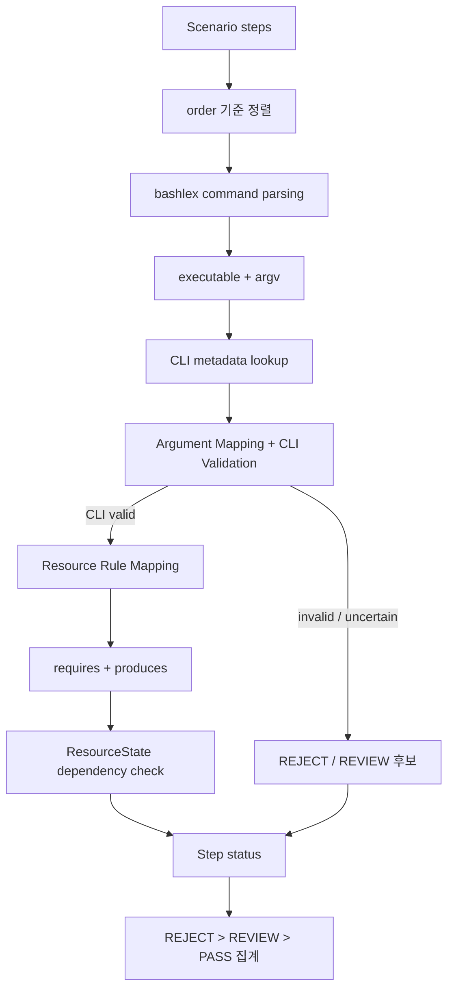

# Scenario Validator Level 2 구현 문서

이 문서는 `levels/level2/`의 현재 구현을 기준으로 Level 2의 책임, 처리 흐름,
데이터 구조와 제한 사항을 설명한다. 설계 방향을 설명하는
`levels/level2/AGENTS.MD`뿐 아니라 실제 Python 코드, JSON 규칙 및 테스트를 함께
확인해 작성했다.

지원 깊이를 구분하는 `full`/`metadata`/`generic` Tier와 metadata 승인 절차는
[Level 2 Support Tier 구현 문서](SUPPORT_TIERS.md)에서 별도로 설명한다.

현재 구현의 extraction, CLI, argument, resource, fact, Tier 정확도를 측정하는
100-case Ground Truth와 실행법은
[Level 2 Evaluation Framework](../evaluation/README.md)를 참고한다.

## 1. 목적과 검증 범위

Level 2는 scenario의 Shell command를 **실행하지 않고 정적으로 분석**한다. 검증의
중심은 다음 세 가지다.

1. command가 현재 지원하는 단순 Shell 구조인지 확인한다.
2. executable의 CLI metadata를 이용해 option, option value, operand를 분류하고
   명백한 CLI 오류를 찾는다.
3. 앞선 step이 만든 resource가 후속 step의 requirement를 충족하는지 확인한다.

Resource dependency를 검사하는 이유는 개별 command가 문법적으로 올바르더라도
공격 단계의 순서가 논리적으로 끊길 수 있기 때문이다. 예를 들어 `chmod`가 사용할
파일을 앞선 `touch`가 만들었다면 연결된 chain이지만, 두 명령의 순서가 반대라면
현재 chain model에서는 필요한 파일이 아직 state에 없다.

### Level 2가 검증하지 않는 것

Level 2는 정적 command/chain model이며 다음 항목을 확인하지 않는다.

- 실제 command 실행 성공 여부
- exploit 실제 성공 여부
- kernel version 또는 kernel config
- privilege 또는 capability
- 실제 namespace 환경과 구성
- seccomp
- LSM
- container runtime 환경
- Tetragon 탐지 또는 차단 여부

파일, device, mountpoint 등이 실제 환경에 존재하는지도 확인하지 않는다. 이러한
환경 의존 검증은 현재 Level 2 코드에 없으며 이후 환경 검증 단계의 책임이다.

## 2. 전체 처리 흐름



### 단계별 데이터 전달

| 단계 | 입력 | 수행 작업 | 출력 |
|---|---|---|---|
| Scenario 정렬 | `scenario["steps"]` | `order` 오름차순 정렬 | 순서가 확정된 step 목록 |
| Command Parsing | raw command 문자열 | `bashlex.parse()` 호출, 지원 AST 확인 | `raw_command`, `executable`, `argv` |
| Argument Mapping | executable + argv | executable metadata 조회, token 순회 | `elements` |
| CLI Validation | metadata와 mapped token | option/value 및 operand 개수 확인 | `cli_validation` |
| Resource Mapping | CLI가 valid인 command 결과 | JSON resource rule 적용 | `requires`, `produces`, `resource_validation` |
| Chain Validation | PASS step의 resource 목록 | requirement 조회 후 state 갱신 | step dependency 오류와 최종 resource state |
| 최종 집계 | 모든 step status | 우선순위 적용 | scenario `PASS`, `REVIEW`, `REJECT` |

CLI validation이 `true`가 아니면 resource mapping은 실행하지 않는다. 이 경우
`requires`와 `produces`는 비어 있고 `resource_validation.resolved`는 `null`이다.
또한 chain validator는 status가 `PASS`인 step만 처리한다.

## 3. 파일 구조와 책임

```text
levels/level2/
├── AGENTS.MD
├── __init__.py
├── validator.py
├── docs/
│   └── README.md
├── parser/
│   ├── __init__.py
│   ├── command_parser.py
│   ├── argument_mapper.py
│   └── metadata_provider.py
├── engine/
│   ├── __init__.py
│   ├── resource.py
│   ├── resource_mapper.py
│   └── chain_validator.py
└── rules/
    ├── cli_metadata.json
    └── resource_rules.json
```

| 파일 | 책임 |
|---|---|
| `AGENTS.MD` | Level 2의 목적, 판정 정책과 책임 범위를 설명하는 설계 지침 |
| `validator.py` | 외부 진입점. command 단계들을 연결하고 scenario 결과를 집계 |
| `parser/command_parser.py` | bashlex AST를 단일 executable과 argv로 축소 |
| `parser/argument_mapper.py` | argv token을 metadata와 매칭하고 CLI validity 계산 |
| `parser/metadata_provider.py` | CLI metadata 모델과 교체 가능한 provider 경계 |
| `engine/resource.py` | hash 가능한 `Resource` 값 객체와 직렬화 |
| `engine/resource_mapper.py` | command 결과에 선언형 resource rule 적용 |
| `engine/chain_validator.py` | step 간 resource state와 dependency 검사 |
| `rules/cli_metadata.json` | 지원 command의 option과 operand 개수 metadata |
| `rules/resource_rules.json` | command별 `requires`/`produces` 의미 |

`__init__.py` 세 파일은 현재 비어 있다. 공개 함수는 package root에서 재수출되지
않으며 코드에서는 `levels.level2.validator`를 직접 import한다.

### 공개 진입점

- `validate_command(command, metadata_provider=None, resource_rule_provider=None)`
  - 한 command를 parse, CLI validate, resource map한다.
  - chain state는 사용하지 않는다.
- `validate_scenario(scenario, metadata_provider=None, resource_rule_provider=None)`
  - `scenario["steps"]`를 정렬하고 전체 Level 2 검증과 판정 집계를 수행한다.

## 4. Command Parsing

### bashlex를 사용하는 이유와 역할

`command_parser.py`는 문자열 분할 대신 Bash 문법 parser인 `bashlex`를 사용한다.
따라서 pipeline이나 command substitution 같은 구조를 단순 공백 분할 결과로
오인하지 않고 AST 종류로 구분할 수 있다. 현재 구현은 AST 전체를 해석하는 것이
아니라 안전하게 지원하는 작은 subset만 받아들인다.

### `parse_command()` 처리

1. 입력이 문자열이며 비어 있지 않은지 확인한다.
2. `bashlex.parse(command)`를 호출한다.
3. top-level node가 정확히 하나인지 확인한다.
4. node의 `kind`가 `command`인지 확인한다.
5. command의 모든 part가 `word`이고 nested `parts`가 없는지 확인한다.
6. 첫 word를 executable, 나머지를 argv로 사용한다.
7. `os.path.basename()`으로 executable을 정규화한다.

입력:

```shell
/usr/bin/mount -t ext4 /dev/sda1 /host
```

출력:

```json
{
  "raw_command": "/usr/bin/mount -t ext4 /dev/sda1 /host",
  "executable": {
    "raw": "/usr/bin/mount",
    "normalized": "mount"
  },
  "argv": ["-t", "ext4", "/dev/sda1", "/host"]
}
```

### 지원하지 않는 Shell 구조

현재 parser는 다음 구조를 거부한다.

- pipeline: `echo value | cat`
- logical list: `&&`, `||`
- 여러 command를 잇는 `;`
- command substitution: `$(...)`
- redirect
- assignment node
- parameter expansion 등 `WordNode.parts`가 생기는 expansion
- top-level node가 여러 개인 입력

이 경우 `CommandParseError`가 발생한다. `validate_command()`를 직접 부르면 예외가
그대로 전달되지만, `validate_scenario()`는 이를 잡아 `PARSER_ERROR`와 step
`REVIEW`로 변환한다.

## 5. Argument Mapping과 CLI Validation

### Metadata lookup

`map_arguments()`는 normalized executable 이름으로 `MetadataProvider.get()`을
호출한다. 기본 구현인 `JsonMetadataProvider`는 최초 조회 때
`rules/cli_metadata.json`을 읽고 다음 객체를 만든다.

- `OptionMetadata`
  - 같은 option의 short/long alias인 `names`
  - `none`, `required`, `optional_attached` 중 하나인 `value`
- `CommandMetadata`
  - option 목록
  - 최소/최대 operand 수
  - 특정 option에 따른 최소 operand override

`MetadataProvider`는 `Protocol`로 정의되어 있어 argument matcher를 수정하지 않고
다른 metadata source를 주입할 수 있다. 현재 코드에는 local man page parser나
ExplainShell SQLite provider는 없으며 JSON provider만 구현되어 있다.

### ExplainShell에서 참고한 방식

현재 구현은 ExplainShell처럼 다음 책임을 분리하는 아이디어를 사용한다.

```text
executable lookup → command metadata → argv 순차 matching
```

ExplainShell 전체 matcher나 man-page extraction pipeline을 포함하거나 복사하지
않는다. 현재 프로젝트에서는 이미 bashlex 처리가 끝난 `argv`를 입력받고, 작은
정적 JSON metadata에 exact option을 조회하는 방식으로 재구성되어 있다.

### Token 분류

`_map_known_command()`는 argv를 왼쪽에서 오른쪽으로 순회한다.

- metadata에서 확인된 token: `option`
- 해당 option이 요구하거나 `=`로 붙은 값: `option_value`
- option으로 처리되지 않은 token: `operand`
- `--` 이후 token: 모두 `operand`

operand를 만날 때마다 1부터 시작하는 `position`이 증가한다. Option value는
operand position에 포함되지 않는다.

Long option의 `--name=value`와 값을 요구하는 short option의 attached form도
분리할 수 있다. 예를 들어 metadata가 `-t`에 값을 요구하면 `-text4`는 `-t`와
`ext4`로 분리된다. 반면 결합 short-option cluster 전체를 일반적으로 분해하지는
않는다.

### 실제 mapping 예

```text
touch /tmp/payload
  operand #1: /tmp/payload

chmod +x /tmp/payload
  operand #1: +x
  operand #2: /tmp/payload

mount -t ext4 /dev/sda1 /host
  option: -t
  option_value(-t): ext4
  operand #1: /dev/sda1
  operand #2: /host

chroot /host /bin/sh
  operand #1: /host
  operand #2: /bin/sh

unshare --mount --fork /bin/bash
  option: --mount
  option: --fork
  operand #1: /bin/bash
```

`chmod +x`가 option이 아닌 이유는 현재 matcher가 `+`로 시작하는 token을 option
후보로 취급하지 않기 때문이다. 더 일반적으로는 prefix만으로 option을 확정할 수
없고 command metadata와 문맥이 필요하다. 다만 현재 구현은 chmod MODE 문법을
별도로 이해하지 않으므로 `chmod -x /tmp/payload`의 `-x`는 MODE operand로
인식되지 않고 `INVALID_OPTION`이 된다. 즉 `+x` 예제는 지원하지만 chmod mode
전체를 command-specific하게 해석하는 구현은 아니다.

### CLI 판정

`cli_validation.valid`는 3-state 값이다.

| 값 | 의미 |
|---|---|
| `true` | 현재 metadata 범위에서 유효 |
| `false` | 명세상 오류로 판정 |
| `null` | 신뢰성 있게 자동 판정하지 못함 |

- executable metadata가 없으면 `UNSUPPORTED_COMMAND`와 `valid: null`이다.
  이 경우 `elements`는 빈 배열이다.
- 지원 command의 알 수 없는 long option 또는 길이 2인 short option은
  `INVALID_OPTION`이다.
- 해석하지 못한 길이 3 이상의 short token은 `UNMAPPED_ARGUMENT`이다.
- required option value 누락, 빈 attached value, 최소/최대 operand 수 위반은
  `INVALID_ARGUMENT`이다.
- `chmod --reference`는 JSON의 `min_operands_by_option`에 의해 일반 chmod와
  다른 최소 operand 수를 적용한다.

## 6. Resource Model

여기서 resource는 Linux의 물리적 자원 전체를 모델링하는 개념이 아니다. Scenario
내 step 사이의 연결을 비교하기 위한 Level 2 내부 상태 값이다.

```json
{
  "type": "file",
  "identity": {
    "path": "/tmp/payload"
  }
}
```

- `type`: 현재 `file`, `mount`, `namespace`가 생성된다.
- `identity`: 같은 type 안에서 resource를 식별하는 key/value 집합이다.
- `requires`: command 실행 전에 state에 있어야 한다고 현재 chain rule이 선언한
  resource다.
- `produces`: requirement가 충족된 PASS step 이후 state에 추가할 resource다.

`Resource.create()`는 identity item을 정렬한 tuple로 보관한다. `key()`는
`sort_keys=True`인 compact JSON 문자열을 반환한다. 따라서 dictionary 입력 순서가
달라도 type과 identity 값이 같으면 같은 resource로 매칭된다.

현재 모델에는 update, delete, effect lifecycle이 없다. 모든 Linux command를
resource화하지도 않는다. Resource rule이 없는 supported command가 들어오면
`map_resources()`는 빈 `requires`/`produces`와 `resolved: true`를 반환한다. 즉
rule 부재 자체는 오류가 아니다.

## 7. Resource Mapping

`JsonResourceRuleProvider`는 `rules/resource_rules.json`을 지연 로딩한다. Parser와
Argument Mapper에는 command별 resource semantics가 들어 있지 않다.

현재 선언형 rule은 다음 기능을 사용한다.

- `requires`와 `produces`
- `for_each_operand.start` 이후의 모든 operand 선택
- 특정 위치의 operand를 identity에 사용
- 현재 반복 중인 operand를 identity에 사용
- `when.option_any`와 `when.option_none`
- 고정 identity 값인 `const`
- resource 해석이 필요한 command를 표시하는 `resolution: required`

### 현재 rule

| Command | Requires | Produces | 비고 |
|---|---|---|---|
| `touch PATH...` | 없음 | 각 `file(path=PATH)` | 모든 operand를 반복 처리 |
| `chmod MODE PATH...` | 각 대상 `file(path=PATH)` | 없음 | 일반 form은 operand #2부터 대상 |
| `chmod --reference=RFILE PATH...` | 각 대상 `file(path=PATH)` | 없음 | `RFILE` 자체는 resource requirement로 만들지 않음 |
| `mount SOURCE TARGET` | 없음 | `mount(source=SOURCE,target=TARGET)` | operand #1과 #2 필요 |
| `unshare` | 없음 | option별 `namespace(kind)` | namespace option이 있어야 해석 가능 |
| `chroot` | 없음 | 없음 | mount dependency를 억지로 만들지 않음 |

`mount -a`처럼 CLI는 valid이지만 source와 target을 얻을 수 없거나,
`unshare --fork /bin/bash`처럼 namespace kind가 결정되지 않으면
`UNRESOLVED_RESOURCE`가 된다. 반대로 `chroot`는 rule에 `resolution: none`과 빈
resource 목록이 명시되어 있어 정상적으로 resolved 처리된다.

## 8. Chain Validation

### ResourceState

`ResourceState`는 앞선 성공 step이 생산한 resource를 `Resource.key()`로 색인하는
dictionary다. 중복 resource를 추가하면 같은 key가 갱신되므로 state에는 하나만
남는다. 최종 결과의 `resource_state`는 key 기준으로 정렬된 배열이다.

### 처리 순서

1. `validate_scenario()`가 입력 step을 `order` 오름차순으로 정렬한다.
2. 각 step의 parse, CLI validation, resource mapping 결과를 만든다.
3. `validate_dependencies()`가 정렬된 step을 순회한다.
4. status가 `PASS`가 아닌 step은 건너뛴다. 해당 step의 produces도 state에
   들어가지 않는다.
5. 모든 requires를 현재 state와 exact resource identity로 비교한다.
6. 누락 resource가 있으면 step을 `REJECT`로 바꾸고 각각
   `MISSING_CHAIN_RESOURCE`를 기록한다. 해당 step의 produces는 추가하지 않는다.
7. 모두 충족되면 produces를 state에 추가한다.

### 연결된 chain

```text
Step 1: touch /tmp/payload
  produces file(path=/tmp/payload)
  State = {file(path=/tmp/payload)}

Step 2: chmod +x /tmp/payload
  requires file(path=/tmp/payload)
  State에서 exact match

결과: PASS
```

반대 순서에서는 첫 `chmod` 시점의 state가 비어 있다. 따라서
`file(path=/tmp/payload)`가 누락되어 `MISSING_CHAIN_RESOURCE`, 최종 `REJECT`가
된다. 뒤의 `touch`는 PASS이므로 이후 state에 파일을 추가하지만 이미 발생한 앞선
dependency 오류를 되돌리지는 않는다.

현재 state는 항상 비어 있는 상태에서 시작하며 scenario 외부에서 원래 존재하는
resource를 주입하는 인터페이스가 없다. 따라서 실제 환경에 파일이 이미 있을 수
있더라도 scenario 안의 앞선 step이 만들지 않은 chmod 대상은 누락으로 판단한다.
이는 현재 MVP chain-created resource model의 명시적인 한계다.

## 9. 오류코드와 최종 판정

현재 Python 코드가 실제로 생성하는 오류코드는 다음과 같다.

| 오류코드 | 발생 단계 | 의미 | Step/최종 판정 |
|---|---|---|---|
| `PARSER_ERROR` | `shell_parsing` | bashlex 실패 또는 지원하지 않는 AST 구조 | REVIEW |
| `UNSUPPORTED_COMMAND` | `cli_validation` | normalized executable의 metadata가 없음 | REVIEW |
| `UNMAPPED_ARGUMENT` | `cli_validation` | 현재 matcher가 short token을 신뢰성 있게 분류하지 못함 | REVIEW |
| `INVALID_OPTION` | `cli_validation` | 지원 command에서 metadata에 없는 option 또는 값을 받지 않는 option의 attached value | REJECT |
| `INVALID_ARGUMENT` | `cli_validation` | option value 누락/빈 값 또는 operand 개수 위반 | REJECT |
| `UNRESOLVED_RESOURCE` | `resource_mapping` | CLI는 valid이나 required resource semantics를 만들 수 없음 | REVIEW |
| `MISSING_CHAIN_RESOURCE` | `dependency_check` | 앞선 PASS step이 required resource를 생산하지 않음 | REJECT |

오류에는 공통적으로 `step`, `stage`, `code`, `command`, `message`가 들어간다.
CLI token 관련 오류는 `element`, dependency 오류는 `resource`를 추가로 포함한다.
Parser-error step은 parsing 이후 필드인 `executable`, `elements`,
`cli_validation`, `resource_validation`을 포함하지 않는다.

### 판정 의미

- **PASS**: 현재 자동 검증 범위 안에서 parsing, CLI, resource resolution 및
  dependency에 문제가 없다.
- **REVIEW**: 잘못됐다고 확정하지 않지만 현재 구현이 신뢰성 있게 분석하지 못한다.
- **REJECT**: CLI metadata 또는 chain model 기준으로 명백한 오류가 있다.

Scenario 집계는 실제 코드에서 다음 우선순위를 사용한다.

```text
REJECT > REVIEW > PASS
```

하나라도 REJECT이면 전체 REJECT다. REJECT 없이 REVIEW가 하나라도 있으면 전체
REVIEW이고, 모든 step이 PASS일 때만 전체 PASS다. Step이 없는 scenario는 status
집합이 비므로 현재 구현상 PASS가 된다.

## 10. 현재 지원 범위

### CLI metadata가 있는 command

- `touch`
- `chmod`
- `mount`
- `chroot`
- `unshare`

각 command가 지원하는 개별 option과 값 필요 여부는
`rules/cli_metadata.json`이 기준이다. 시스템에 실제 설치된 executable 또는 man
page를 조회하지 않는다.

### Resource semantics가 있는 command

- `touch`: file 생산
- `chmod`: file 요구
- `mount`: mount 생산
- `unshare`: mount, uts, ipc, net, pid, user, cgroup, time namespace 생산
- `chroot`: 의도적으로 resource 없음

### 제한되는 Shell 구조

다음 구조는 지원하지 않고 scenario 검증에서 `PARSER_ERROR`/REVIEW가 된다.

- pipeline
- `&&`, `||`, `;`
- redirect
- assignment
- command substitution
- parameter expansion을 포함한 word
- process substitution을 비롯한 nested expansion
- compound/multiple command

현재 가정은 scenario step 하나에 expansion 없는 단순 command 하나가 들어온다는
것이다.

## 11. 테스트와 실제 검증 결과

테스트는 Python 표준 `unittest`를 사용한다.

- `tests/test_command_parser.py`: 정상 command, 절대경로 정규화, 복잡한 Shell
  구조 및 빈/잘못된 command 거부
- `tests/test_level2_argument_mapping.py`: 5개 command mapping, CLI 오류,
  unsupported/unmapped 결과
- `tests/test_level2_scenario_validation.py`: resource mapping, chain PASS/REJECT,
  parser/CLI/resource REVIEW와 집계 우선순위

2026-08-07에 다음 명령으로 실제 실행했다.

```shell
PYTHONPATH=/tmp/scenario-validator-bashlex-deps:. \
  python3 -m unittest discover -s tests -v
```

실행 결과:

```text
Ran 25 tests in 0.009s

OK
```

### PASS 예

입력:

```text
1. touch /tmp/payload
2. chmod +x /tmp/payload
```

처리:

```text
touch elements:
  operand #1 /tmp/payload
touch produces:
  file(path=/tmp/payload)

chmod elements:
  operand #1 +x
  operand #2 /tmp/payload
chmod requires:
  file(path=/tmp/payload)

dependency match → PASS
```

### REVIEW 예

입력:

```shell
some-unknown-tool --foo
```

처리:

```text
normalized executable: some-unknown-tool
CLI metadata: 없음
elements: []
cli_validation: valid=null, code=UNSUPPORTED_COMMAND
최종 판정: REVIEW
```

`mount -a`도 CLI metadata 기준으로 valid이지만 mount source/target을 얻을 수 없어
`UNRESOLVED_RESOURCE`, REVIEW가 된다.

### REJECT 예: CLI

입력:

```shell
unshare --definitely-invalid-option
```

처리:

```text
--definitely-invalid-option이 unshare metadata에 없음
cli_validation: valid=false, code=INVALID_OPTION
최종 판정: REJECT
```

### REJECT 예: chain

입력:

```text
1. chmod +x /tmp/payload
2. touch /tmp/payload
```

처리:

```text
chmod requires file(path=/tmp/payload)
초기 ResourceState에는 해당 resource가 없음
MISSING_CHAIN_RESOURCE
최종 판정: REJECT
```

## 12. 한계와 향후 확장 지점

### CLI와 Shell parsing

- CLI metadata coverage는 5개 command로 제한된다.
- Metadata는 정적 JSON이며 installed command 버전이나 local man page와 자동으로
  동기화되지 않는다.
- ExplainShell의 man-page extraction/store는 구현되어 있지 않다.
- 결합 short option cluster를 일반적으로 분해하지 않는다. 예를 들어 현재 테스트의
  `mount -lhV`는 `UNMAPPED_ARGUMENT`이다.
- chmod MODE 문법을 검증하지 않는다. 특히 `-x` MODE는 현재 option 후보가 되어
  잘못된 `INVALID_OPTION` 판정을 받을 수 있다.
- command 뒤에서 시작하는 nested executable의 option 문맥을 따로 해석하지 않는다.
- Bash expansion, redirect, pipeline, compound command를 지원하지 않는다.

### Resource와 chain

- Resource semantics는 JSON에 직접 규칙을 추가해야 한다.
- Rule은 operand 위치와 option 존재 조건 중심이며 복잡한 command 의미를 표현하지
  못한다.
- `mount --source ... --target ...`의 option value로 mount identity를 만드는 규칙은
  없다. 현재 mount rule은 operand #1/#2만 사용한다.
- `chmod --reference`의 reference file 자체는 requirement로 모델링하지 않는다.
- 외부 환경의 기존 resource와 scenario가 만든 resource를 구분하거나 초기 state를
  주입하지 못한다.
- Resource update/delete/effect와 scope/lifetime 모델이 없다.
- Namespace resource가 실제로 후속 process에 적용되는지 확인하지 않는다.
- 현재 resource consumer가 제한적이어서 mount와 namespace는 생산되지만 이를
  요구하는 후속 rule은 없다.

### 환경 검증과의 경계

정적 Level 2만으로 실제 성공 여부를 확정할 수 없다. Kernel version/config,
capability, 실제 namespace configuration, seccomp, LSM, container runtime 같은
조건은 현재 구현 범위 밖이며 향후 환경 검증(Level 4)에서 다뤄야 한다. 실제
command 또는 exploit 실행과 Tetragon 검증 역시 이 코드에는 없다.

## 13. 실행 예

의존성 설치:

```shell
python3 -m venv .venv
. .venv/bin/activate
python3 -m pip install -r requirements.txt
```

테스트:

```shell
python3 -m unittest discover -s tests -v
```

Scenario 검증:

```python
import json

from levels.level2.validator import validate_scenario

scenario = {
    "steps": [
        {"order": 1, "command": "touch /tmp/payload"},
        {"order": 2, "command": "chmod +x /tmp/payload"},
    ]
}

print(json.dumps(validate_scenario(scenario), indent=2, ensure_ascii=False))
```
