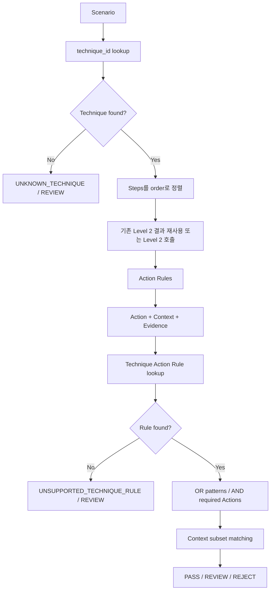

# Scenario Validator Level 3 구현 문서

이 문서는 `levels/level3/`의 현재 구현을 기준으로 Level 3의 책임, 데이터 흐름,
규칙 구조와 판정 정책을 설명한다. 실제 Python 코드, 로컬 MITRE ATT&CK STIX
데이터, JSON 규칙 및 테스트를 확인해 작성했다.

## 1. 목적과 검증 범위

Level 3는 scenario에 선언된 MITRE ATT&CK `technique_id`와 scenario command에서
독립적으로 추출한 저수준 Action이 의미적으로 일치하는지 정적으로 검증한다.

검증의 중심은 다음 세 가지다.

1. `technique_id`가 로컬 Enterprise ATT&CK 데이터에 존재하는지 확인한다.
2. Level 2가 구조화한 command를 표준 `Action + Context + Evidence`로 변환한다.
3. Scenario 전체 Action 집합에 Technique의 core Action pattern이 존재하는지
   확인하고 PASS, REVIEW, REJECT를 결정한다.

Level 3가 모든 step을 Technique에 직접 연결하려는 것은 아니다. 공격 scenario에는
파일 생성, 권한 설정, 준비 command 같은 supporting step이 포함될 수 있다. 현재
검증기는 이러한 step의 존재가 아니라 **Technique core pattern의 존재 여부**를
판정한다.

### Level 3가 검증하지 않는 것

현재 구현은 다음 항목을 확인하지 않는다.

- command의 실제 실행 성공 여부
- exploit 실제 성공 여부
- `goal` 또는 `purpose`와 Technique의 자연어 의미 일치
- Technique description과 command 문자열의 유사도
- kernel version 또는 kernel config
- 실제 UID/EUID transition
- privilege 또는 capability 충족 여부
- 실제 namespace 또는 mount 환경
- seccomp, LSM
- container runtime 환경
- Tetragon 탐지 또는 차단 여부
- Level 4 환경 적합성

Level 3는 rule 기반 정적 의미 검증기다. ATT&CK Technique을 보고 command Action을
역으로 만들어내지 않으며 실제 command를 실행하지 않는다.

## 2. 전체 처리 흐름



### 단계별 입출력

| 단계 | 입력 | 수행 작업 | 출력 |
|---|---|---|---|
| Technique Lookup | `scenario["technique_id"]` | ATT&CK external ID로 STIX index 조회 | `technique_lookup` |
| Step 정렬 | `scenario["steps"]` | `order` 오름차순 정렬 | 순서가 확정된 step |
| Level 2 연결 | step 또는 기존 `level2_output` | executable, elements, resources 확보 | Level 2 structured command |
| Action Mapping | Level 2 결과 | 선언형 command rule 적용 | `actions`, `action_validation` |
| Technique Rule Lookup | 정규화된 Technique ID | Technique pattern 조회 | patterns, supporting actions |
| Pattern Matching | 모든 step의 Action | OR/AND와 context subset 검사 | `technique_validation` |
| 최종 판정 | `matched: true/false/null` | status와 error 생성 | Level 3 결과 |

Technique lookup이 실패하면 step mapping은 실행하지 않는다. 이때 `steps`는 빈
배열이고 `technique_validation`은 `null`이다.

## 3. 파일 구조와 책임

```text
levels/level3/
├── AGENTS.MD
├── __init__.py
├── validator.py
├── docs/
│   └── README.md
├── data/
│   ├── README.md
│   ├── LICENSE.txt
│   └── enterprise-attack-19.2-techniques.json
├── providers/
│   ├── __init__.py
│   └── attack_provider.py
├── mapper/
│   ├── __init__.py
│   ├── action_rule_provider.py
│   └── action_mapper.py
├── engine/
│   ├── __init__.py
│   ├── technique_rule_provider.py
│   └── technique_action_validator.py
└── rules/
    ├── action_rules.json
    └── technique_action_rules.json
```

| 파일 | 책임 |
|---|---|
| `AGENTS.MD` | 현재 0바이트이며 별도 Level 3 지침 내용은 없음 |
| `validator.py` | Technique lookup, step mapping, semantic validation과 최종 판정 조합 |
| `providers/attack_provider.py` | 로컬 STIX bundle을 읽고 Technique metadata 정규화 |
| `mapper/action_rule_provider.py` | Action rule JSON 지연 로딩과 top-level schema 확인 |
| `mapper/action_mapper.py` | Level 2 결과를 Technique과 독립적인 Action으로 변환 |
| `engine/technique_rule_provider.py` | Technique Action rule JSON 지연 로딩 |
| `engine/technique_action_validator.py` | Core/supporting Action과 OR/AND pattern matching |
| `rules/action_rules.json` | Action/Context vocabulary와 command-to-Action 규칙 |
| `rules/technique_action_rules.json` | 8개 Technique의 core/supporting pattern |
| `data/enterprise-attack-19.2-techniques.json` | 로컬 Enterprise ATT&CK STIX subset |

### 공개 인터페이스

- `levels.level3.validate_scenario(...)`
  - Level 3 전체 외부 진입점이다.
- `AttackProvider.get_technique(technique_id)`
  - Technique metadata만 조회한다.
- `map_actions(level2_result, rule_provider=None)`
  - 한 Level 2 command 결과를 Action으로 변환한다.
- `validate_technique_actions(technique_id, step_results, rule_provider=None)`
  - 이미 생성된 step Action과 Technique rule만 비교한다.

Provider 인자를 주입할 수 있어 기본 JSON 파일 대신 테스트용 rule/data를 사용할 수
있다.

## 4. ATT&CK 데이터와 Technique Lookup

### 로컬 데이터

기본 provider는 다음 파일을 사용한다.

```text
levels/level3/data/enterprise-attack-19.2-techniques.json
```

MITRE 공식 `attack-stix-data`의 Enterprise ATT&CK v19.2 STIX 2.1 bundle에서
Technique lookup에 필요한 객체만 기계적으로 필터링한 약 3.7MB의 로컬 snapshot이다.

| 항목 | 값 |
|---|---|
| ATT&CK release | 19.2 |
| 원본 commit | `6cda5ad8462c79e14fbb872f4e09059b18e0cfc4` |
| commit 날짜 | 2026-08-05 |
| `attack-pattern` | 858개 |
| `x-mitre-tactic` | 15개 |
| `subtechnique-of` relationship | 477개 |

런타임 네트워크 요청은 없다. 출처, SHA-256, 필터 명령과 MITRE 사용 조건은
`data/README.md`와 `data/LICENSE.txt`에 기록되어 있다.

### `AttackProvider` index 생성

`AttackProvider`는 첫 lookup 때 bundle 전체를 읽고 다음 index를 만든다.

1. `type == "attack-pattern"` 객체를 STIX ID로 색인한다.
2. `x-mitre-tactic`을 `x_mitre_shortname → name`으로 색인한다.
3. `subtechnique-of` relationship을 child STIX ID에서 parent STIX ID로 연결한다.
4. 각 attack pattern의 `external_references`에서
   `source_name == "mitre-attack"`인 `external_id`를 찾는다.
5. `T1611`, `T1548.001` 같은 external ID로 최종 Technique index를 만든다.

Duplicate external ID가 있거나 bundle을 읽을 수 없으면 `AttackDataError`가
발생한다.

### Technique metadata

```json
{
  "found": true,
  "technique": {
    "id": "T1611",
    "name": "Escape to Host",
    "description": "...",
    "tactics": [
      {
        "name": "Privilege Escalation",
        "shortname": "privilege-escalation"
      }
    ],
    "platforms": ["Windows", "Linux", "Containers", "ESXi"],
    "is_subtechnique": false,
    "parent_id": null,
    "deprecated": false,
    "revoked": false,
    "stix_id": "attack-pattern--..."
  }
}
```

- ID 입력은 trim 후 대문자로 정규화한다.
- Tactic은 `kill_chain_phases`의 `mitre-attack` phase와 실제 tactic 객체를
  연결한다. Description 문자열에서 추측하지 않는다.
- Sub-technique 여부는 `x_mitre_is_subtechnique`를 사용한다.
- Parent는 실제 `subtechnique-of` relationship으로만 찾는다. ID에 점이 있다는
  이유로 추측하지 않는다.
- Deprecated와 revoked는 metadata로만 반환한다. 최종 Level 3 status에는 영향을
  주지 않는다.

존재하지 않는 ID 결과:

```json
{
  "found": false,
  "code": "UNKNOWN_TECHNIQUE",
  "technique_id": "T999999"
}
```

## 5. Level 2 결과 재사용

Level 3 Action Mapper는 raw Shell 문자열을 다시 parsing하지 않는다. 사용하는 Level
2 필드는 다음과 같다.

- `executable.raw`
- `executable.normalized`
- `elements[].type`
- option `raw`
- operand `raw`, `position`
- `resources.requires`
- `resources.produces`
- resource `type`, `identity`

### 두 가지 연결 방식

`validate_scenario()`에 `level2_output`이 주어지면 `order`를 key로 step 결과를
재사용한다.

```python
level3_result = validate_scenario(
    scenario,
    level2_output=level2_result,
)
```

주어지지 않으면 Level 3 validator가 Level 2의 공개 함수
`validate_command(command)`를 호출한다. Parsing과 CLI/resource 분석은 여전히
Level 2 코드가 수행하며 Level 3가 별도로 구현하지 않는다.

현재 연결은 `order`만 비교한다. 제공된 Level 2 step의 command가 Level 3 scenario의
동일 order command와 같은지 확인하지 않는다. 또한 Level 3는 Level 2의 최종
PASS/REVIEW/REJECT를 자체 status에 합산하지 않는다. Level 2 validity와 dependency
판정은 별도로 소비해야 한다.

Parser가 실패하면 해당 Level 3 step은 빈 Action과 다음 상태를 가진다.

```json
{
  "mapped": false,
  "code": "UNMAPPED_ACTION",
  "source_code": "PARSER_ERROR",
  "message": "..."
}
```

## 6. Action과 Context Model

Action은 command가 수행하는 저수준 행위이고 Context는 그 행위의 확정 가능한
속성이다. ATT&CK Technique ID나 공격 목적은 Action 이름에 포함하지 않는다.

### 등록된 Action vocabulary

```text
EXECUTE_PROGRAM          EXECUTE_FILE
CREATE_FILE              WRITE_FILE
READ_FILE                CREATE_MEMORY_FILE
CHANGE_FILE_PERMISSION   CONNECT_ENDPOINT
CONNECT_SOCKET           CREATE_NAMESPACE
ENTER_NAMESPACE          MOUNT_FILESYSTEM
TRACE_PROCESS            WRITE_PROCESS_MEMORY
TERMINATE_PROCESS        LOAD_KERNEL_MODULE
LOAD_BPF_PROGRAM         MODIFY_SECURITY_CONTROL
```

### 등록된 Context vocabulary

```text
program_type       program_category    privilege_context
path_type          backing             file_state
data_type          credential_type     permission
endpoint_type      socket_type         namespace_type
namespace_context  target_context      source_type
operation          interface           process_type
control_type       module_source       bpf_type
uid_transition     transfer_source
```

Vocabulary 등록은 mapper가 해당 Action을 실제로 생성한다는 뜻이 아니다. 현재 JSON
rule이 실제로 생성하는 Action과 Context는 아래 지원 범위에 별도로 정리한다.

### Action 출력

```json
{
  "action": "CREATE_NAMESPACE",
  "context": {
    "namespace_type": "mount"
  },
  "evidence": {
    "executable": "unshare",
    "option": "--mount"
  }
}
```

- `action`: 표준 vocabulary 항목
- `context`: command 구조에서 확정할 수 있는 속성만 포함
- `evidence`: 어떤 executable, option, operand 또는 resource가 Action을 만들었는지
  설명하는 근거

Context와 Evidence는 분리된다. Evidence는 Technique matching 조건으로 직접
사용되지 않는다.

## 7. Action Rule 구조와 Matching

`JsonActionRuleProvider`는 `rules/action_rules.json`을 지연 로딩한다. Top-level
schema version과 vocabulary/rules/path group의 자료형을 확인한다. 내부 rule의 모든
필드를 사전에 완전 검증하지는 않는다.

### Rule 구조

```json
{
  "id": "create-namespace",
  "match": {
    "executable": "unshare"
  },
  "iterate": {
    "options": {
      "values": {
        "--mount": "mount",
        "--user": "user"
      }
    }
  },
  "emit": {
    "action": "CREATE_NAMESPACE",
    "context": {
      "namespace_type": {"from": "iteration.value"}
    },
    "evidence": {
      "option": {"from": "iteration.option"}
    }
  }
}
```

### 지원하는 match 조건

- exact normalized `executable`
- normalized executable 목록인 `executable_in`
- `executable.raw`의 path prefix group
- 특정 position의 operand 정규식
- `requires` 또는 `produces` resource type

### 반복과 값 추출

- `iterate.options`: 일치한 option마다 Action 생성
- `iterate.resources`: 해당 resource마다 Action 생성
- `const`: 고정 context/evidence 값
- `from`: matching state의 값 참조
- `path_group_of`: 경로를 정의된 group으로 분류

현재 temporary path group은 다음 세 prefix다.

```text
/tmp/
/var/tmp/
/dev/shm/
```

동일한 Action/context/evidence 결과는 정렬된 JSON key로 중복 제거된다. 하나의
command에서 여러 Action을 만들 수 있다.

### 현재 command-to-Action 규칙

| 입력 근거 | Action | Context |
|---|---|---|
| `bash`, `sh`, `dash`, `zsh`, `ksh` | `EXECUTE_PROGRAM` | `program_type=shell` |
| temporary path executable | `EXECUTE_FILE` | `path_type=temporary` |
| `sudo` | `EXECUTE_PROGRAM` | `privilege_context=sudo` |
| `touch`가 생산한 file resource | `CREATE_FILE` | temporary일 때 `path_type=temporary` |
| chmod mode `u+s` 또는 `4xxx` | `CHANGE_FILE_PERMISSION` | `permission=setuid` |
| chmod mode `g+s` 또는 `2xxx` | `CHANGE_FILE_PERMISSION` | `permission=setgid` |
| `unshare` namespace option | `CREATE_NAMESPACE` | option별 `namespace_type` |
| `mount`가 생산한 mount resource | `MOUNT_FILESYSTEM` | 현재 확정 context 없음 |

`unshare --mount --user /bin/bash`는 mount와 user namespace Action을 각각 만들지만
operand `/bin/bash`의 nested execution은 추론하지 않는다.

### `UNMAPPED_ACTION`

어떤 Action rule도 결과를 만들지 않으면 command 오류라고 단정하지 않는다.

```json
{
  "actions": [],
  "action_validation": {
    "mapped": false,
    "code": "UNMAPPED_ACTION"
  }
}
```

예를 들어 현재 `chroot /host /bin/sh`는 Level 2에서는 구조화되지만 Level 3 Action
rule이 없어 위 결과가 된다.

## 8. Technique Action Rule

Technique-specific 의미는 mapper가 아니라
`rules/technique_action_rules.json`에만 있다. 따라서 command Action은 Technique
ID를 입력받지 않고 독립적으로 생성된다.

```json
{
  "T1552.005": {
    "patterns": [
      {
        "id": "cloud-metadata-endpoint",
        "required": [
          {
            "action": "CONNECT_ENDPOINT",
            "context": {
              "endpoint_type": "cloud_metadata"
            }
          }
        ]
      }
    ],
    "supporting_actions": [],
    "limitations": ["..."]
  }
}
```

- `patterns`: 서로 대체 가능한 OR pattern 목록
- `required`: 해당 pattern에서 모두 필요한 core Action 목록
- `supporting_actions`: Technique 판정의 필수조건은 아니지만 evidence로 수집할
  Action
- `limitations`: 현재 규칙이 Technique 전체를 완전히 증명하지 못하는 부분

`JsonTechniqueRuleProvider`는 `schema_version == 1`과 `techniques`가 dictionary인지
확인한다. 개별 pattern/action의 전체 schema를 선제적으로 검증하지는 않는다.

## 9. Core / Supporting Action

### Core Action

각 pattern의 `required` 항목이다. Technique가 성립하려면 한 pattern의 모든
required Action이 실제 Action에 연결되어야 한다.

### Supporting Action

`supporting_actions`는 다음 원칙으로 처리된다.

- 없어도 core match에 영향이 없다.
- 있으면 `supporting_evidence`에 step order, command, Action, Context를 기록한다.
- Supporting Action이 다른 Technique과 더 가까워 보여도 core match를 실패시키지
  않는다.
- `UNMAPPED_ACTION` step이 있어도 core pattern이 완전히 매치되면 PASS다.

검증기는 먼저 core match를 찾고 성공하면 즉시 반환한다. Unmapped step 여부는 core
match가 없을 때만 REVIEW 판단에 사용한다.

## 10. Technique Pattern Matching

### Scenario Action 평탄화

모든 step의 Action을 다음 형태로 평탄화한다.

```json
{
  "step_order": 2,
  "command": "...",
  "action": "CONNECT_ENDPOINT",
  "context": {"endpoint_type": "cloud_metadata"},
  "evidence": {}
}
```

기본 matching은 step sequence가 아닌 scenario 전체 Action 집합을 대상으로 한다.
Level 2 dependency 검증을 다시 구현하지 않으며 Technique-specific sequence rule도
현재 없다.

### OR와 AND

- `patterns` 사이: OR
- 한 pattern의 `required` 사이: AND

AND에서 하나의 actual Action을 두 requirement가 동시에 소비할 수 없다. Recursive
backtracking으로 서로 다른 Action 할당을 찾기 때문에 requirement 또는 actual
Action의 순서에 의존하지 않는다.

### Context subset matching

Required context만 actual context에서 검사한다.

```text
required = {data_type: credential}
actual   = {data_type: credential, credential_type: service_account_token}

→ match
```

Rule에 없는 additional context는 무시한다.

Context 비교 결과는 세 가지다.

| 결과 | 조건 | 의미 |
|---|---|---|
| `match` | 모든 required key/value 일치 | 확정 match |
| `missing` | required key가 actual에 없음 | 현재 정보로 결론 불가 |
| `conflict` | key는 있지만 값이 다름 | 명시적인 불일치 |

Exact assignment가 없으면 `match`와 `missing`을 허용한 가능한 assignment를 다시
찾는다. 가능하면 `INSUFFICIENT_ACTION_CONTEXT`/REVIEW, 불가능하면 unmapped 여부를
확인한 뒤 REVIEW 또는 명백한 mismatch로 처리한다.

### Match 결과

```json
{
  "technique_id": "T1552.005",
  "matched": true,
  "matched_pattern": 0,
  "matched_pattern_id": "cloud-metadata-endpoint",
  "required_actions": [
    {
      "action": "CONNECT_ENDPOINT",
      "context": {"endpoint_type": "cloud_metadata"}
    }
  ],
  "evidence": [
    {
      "step_order": 2,
      "command": "...",
      "action": "CONNECT_ENDPOINT",
      "context": {"endpoint_type": "cloud_metadata"},
      "evidence": {}
    }
  ],
  "supporting_evidence": [],
  "code": null
}
```

Mismatch 또는 indeterminate 결과에서는 `matched_pattern`이 `null`이고 현재
구현상 `required_actions`와 core `evidence`는 빈 배열이다.

## 11. 지원 Technique Rule

| Technique | OR Core Pattern | Supporting | 현재 의미상 한계 |
|---|---|---|---|
| `T1548.001` | permission=setuid OR permission=setgid OR setuid context 실행 | 없음 | 실제 UID/EUID transition을 증명하지 않음 |
| `T1610` | container runtime socket 연결 | 없음 | socket 접근이 container 배포 자체의 완전한 증명은 아님 |
| `T1552.001` | credential data file 읽기 | 없음 | 현재 mapper가 credential read를 만들지 않음 |
| `T1611` | host namespace 진입 OR host filesystem mount | namespace 생성 | namespace 생성만으로 host escape를 증명하지 않음 |
| `T1105` | external source file 생성 OR 쓰기 | temporary file 생성/쓰기/실행 | temporary path만으로 외부 유입을 증명하지 않음 |
| `T1552.005` | cloud metadata endpoint 연결 | 없음 | 현재 mapper가 endpoint 연결을 만들지 않음 |
| `T1562.001` | BPF control detach OR security agent 종료 | 없음 | 현재 mapper가 두 Action을 만들지 않음 |
| `T1620` | memory-backed file 실행 | memfd 생성 | memfd 생성만으로 memory execution을 증명하지 않음 |

### Action Rule과 Technique Rule coverage 차이

Technique engine은 위 8개 core pattern을 모두 비교할 수 있지만 현재 command-to-
Action mapper가 생성하는 Action은 일부뿐이다. 따라서 모든 Technique이 raw command
scenario에서 end-to-end PASS 가능한 것은 아니다.

예를 들어:

- `chmod u+s ...`는 현재 T1548.001 end-to-end PASS가 가능하다.
- `touch /tmp/payload`는 T1105 supporting evidence는 되지만
  `transfer_source=external`이 없어 REVIEW다.
- 일반 mount Action에는 `target_context=host`가 없어 T1611 core match가 확정되지
  않는다.
- CONNECT_ENDPOINT, CONNECT_SOCKET, READ_FILE, MODIFY_SECURITY_CONTROL,
  TERMINATE_PROCESS, memory-backed EXECUTE_FILE을 command에서 만드는 rule은 아직
  없다.

## 12. 최종 Validator와 출력

### `validate_scenario()`

```python
validate_scenario(
    scenario,
    level2_output=None,
    attack_provider=None,
    action_rule_provider=None,
    technique_rule_provider=None,
)
```

처리 순서:

1. `technique_id` lookup
2. Technique가 없으면 REVIEW 반환
3. step을 `order`로 정렬
4. 기존 Level 2 결과를 order로 조회하거나 Level 2 command validator 호출
5. 각 step Action Mapping
6. 정규화된 Technique ID의 rule 조회
7. 전체 Action에 pattern matcher 적용
8. `matched` 값을 Level 3 status로 변환

### 최종 출력 구조

```json
{
  "level": 3,
  "status": "PASS",
  "technique_lookup": {
    "found": true,
    "technique": {
      "id": "T1548.001",
      "name": "Setuid and Setgid"
    }
  },
  "steps": [
    {
      "order": 1,
      "command": "chmod u+s /tmp/rootsh",
      "level2": {"...": "Level 2 command result"},
      "actions": [
        {
          "action": "CHANGE_FILE_PERMISSION",
          "context": {"permission": "setuid"},
          "evidence": {"executable": "chmod", "operand": "u+s"}
        }
      ],
      "action_validation": {"mapped": true, "code": null}
    }
  ],
  "technique_validation": {
    "matched": true,
    "matched_pattern_id": "setuid-permission",
    "code": null
  },
  "errors": []
}
```

위 예는 필드 설명을 위한 축약 형태이며 실제 `technique_lookup.technique`와 Level 2
결과에는 전체 metadata가 포함된다.

## 13. 오류코드와 판정 정책

| 코드 | 발생 단계 | 의미 | 최종 판정 |
|---|---|---|---|
| `UNKNOWN_TECHNIQUE` | `technique_lookup` | 로컬 ATT&CK snapshot에 Technique ID가 없음 | REVIEW |
| `UNSUPPORTED_TECHNIQUE_RULE` | `technique_action_validation` | Technique은 존재하지만 semantic rule이 없음 | REVIEW |
| `UNMAPPED_ACTION` | Action Mapping / Technique validation | command Action을 모르며 core 여부를 배제할 수 없음 | REVIEW 후보 |
| `PARSER_ERROR` | Level 2 source error | command parsing 실패로 Action을 만들 수 없음 | `source_code`; core가 없으면 REVIEW 후보 |
| `INSUFFICIENT_ACTION_CONTEXT` | `technique_action_validation` | 같은 Action은 있으나 필수 Context key가 없음 | REVIEW |
| `TECHNIQUE_ACTION_MISMATCH` | `technique_action_validation` | 지원 rule과 충분히 mapped된 Action이 명백히 불일치 | REJECT |

`AttackDataError`, `ActionRuleError`, `TechniqueRuleError`는 scenario 판정 코드가
아니라 local data/rule 파일을 읽거나 검증할 수 없을 때 발생하는 예외다.

### PASS

- Technique lookup 성공
- Technique rule 존재
- 한 core pattern의 모든 required Action/context가 exact match

Core match가 확실하면 supporting 또는 unmapped step이 있어도 PASS다.

### REVIEW

- unknown Technique
- 지원하지 않는 Technique rule
- 필수 Context가 없음
- core가 매치되지 않았고 하나 이상의 Action이 unmapped

Validator가 모른다는 사실을 scenario 오류로 단정하지 않는다.

### REJECT

- Technique와 rule이 지원됨
- Action 정보가 충분함
- 어떤 core pattern도 성립하지 않음
- missing context나 unmapped 가능성도 없음

현재 최종 status는 `technique_validation.matched`를 직접 변환한다.

```text
true  → PASS
false → REJECT
null  → REVIEW
```

Semantic core match가 먼저 평가되므로 supporting `UNMAPPED_ACTION`보다 확정
PASS가 우선한다. 일반적인 의미의 정책은 `REJECT > REVIEW > PASS`지만, Level 3는
step error를 단순 우선순위 집계하지 않고 core match에 실제 영향을 미치는 unknown만
판정에 반영한다.

### Empty scenario 동작

- 존재하며 rule이 지원되는 Technique + 빈 steps: 현재 `TECHNIQUE_ACTION_MISMATCH`,
  REJECT
- 존재하지만 rule이 없는 Technique + 빈 steps: REVIEW
- unknown Technique + 빈 steps: REVIEW

## 14. 테스트와 실제 결과

Level 3 관련 테스트:

- `tests/test_attack_provider.py`
  - 8개 Technique lookup
  - parent relationship, revoked 상태, unknown ID, invalid bundle
- `tests/test_level3_action_mapping.py`
  - shell/temporary file/chmod/namespace/mount/touch/sudo mapping
  - 한 command의 복수 Action
  - nested execution 비추론
  - `UNMAPPED_ACTION`
  - Action rule에 Technique ID가 없음을 확인
- `tests/test_level3_technique_validation.py`
  - 8개 Technique rule과 core match
  - OR/AND 및 backtracking
  - Context subset/missing/conflict
  - supporting/unmapped와 core 우선순위
  - Level 2 결과 재사용
  - 최종 PASS/REVIEW/REJECT

2026-08-08에 전체 suite를 실제 실행한 결과:

```text
Ran 65 tests in 0.202s

OK
```

### PASS 예

입력:

```json
{
  "technique_id": "T1548.001",
  "steps": [
    {"order": 1, "command": "chmod u+s /tmp/rootsh"}
  ]
}
```

처리:

```text
Technique: Setuid and Setgid
Action: CHANGE_FILE_PERMISSION(permission=setuid)
Pattern: setuid-permission
Result: PASS
```

### REVIEW 예: Context 부족

```text
Technique: T1105
Command: touch /tmp/payload
Action: CREATE_FILE(path_type=temporary)
Required: CREATE_FILE(transfer_source=external)

transfer_source key가 없음
→ INSUFFICIENT_ACTION_CONTEXT
→ REVIEW
```

### REVIEW 예: 지원 rule 없음

```text
Technique: T1059
ATT&CK lookup: found
Technique Action rule: 없음
→ UNSUPPORTED_TECHNIQUE_RULE
→ REVIEW
```

### REJECT 예

```text
Technique: T1552.005
Command: unshare --mount
Actual: CREATE_NAMESPACE(namespace_type=mount)
Required: CONNECT_ENDPOINT(endpoint_type=cloud_metadata)

Action은 mapped됐지만 core pattern과 무관
→ TECHNIQUE_ACTION_MISMATCH
→ REJECT
```

### Supporting/Unmapped와 Core

테스트에서는 다음 두 경우 모두 PASS임을 확인한다.

```text
CREATE_FILE(path_type=temporary)
+ CONNECT_ENDPOINT(endpoint_type=cloud_metadata)
→ T1552.005 PASS
```

```text
UNMAPPED_ACTION step
+ CONNECT_ENDPOINT(endpoint_type=cloud_metadata)
→ T1552.005 PASS
```

## 15. 현재 지원 범위

### Lookup 가능한 데이터

- Enterprise ATT&CK v19.2 snapshot의 attack-pattern
- Parent/sub-technique relationship
- Tactic, platform, deprecated, revoked metadata

### Command에서 실제 생성 가능한 Action

- `EXECUTE_PROGRAM`
- `EXECUTE_FILE`
- `CREATE_FILE`
- `CHANGE_FILE_PERMISSION`
- `CREATE_NAMESPACE`
- `MOUNT_FILESYSTEM`

### Command에서 실제 생성 가능한 Context

- `program_type`
- `privilege_context`
- `path_type`
- `permission`
- `namespace_type`

### Semantic rule이 있는 Technique

- `T1548.001`
- `T1610`
- `T1552.001`
- `T1611`
- `T1105`
- `T1552.005`
- `T1562.001`
- `T1620`

## 16. 한계와 향후 확장 지점

### ATT&CK data

- Enterprise ATT&CK v19.2에 고정되어 자동 갱신되지 않는다.
- Mobile/ICS ATT&CK는 포함하지 않는다.
- software, group, procedure relationship 등은 subset에 없다.
- Deprecated/revoked metadata가 있어도 validator가 자동 REVIEW/REJECT하지 않는다.
- 최초 lookup 시 약 3.7MB bundle 전체를 메모리에 읽는다.

### Action Mapping

- Bash `-c` 내부 command를 해석하지 않는다.
- `sudo` 이후 nested program과 실제 UID transition을 해석하지 않는다.
- chmod mode는 `u+s`, `g+s`, `4xxx`, `2xxx` 일부만 지원한다.
- combined numeric mode 등 전체 chmod 문법을 다루지 않는다.
- temporary path는 문자열 prefix 비교이며 canonical path normalization이 없다.
- Endpoint, runtime socket, credential read, memfd, process/security-control Action을
  command에서 생성하는 rule이 없다.
- Level 2 CLI가 unsupported여도 보존된 executable만으로 shell/direct path Action이
  생성될 수 있다.

### Technique Matching

- Action 순서는 검사하지 않고 scenario 전체 집합으로 비교한다.
- Negative pattern, forbidden Action, count constraint가 없다.
- Pattern 간 우선순위는 JSON 순서이며 첫 exact match를 반환한다.
- Supporting Action은 evidence일 뿐 판정 점수나 confidence를 만들지 않는다.
- Rule의 `limitations`는 metadata이며 matcher 로직에 영향을 주지 않는다.
- T1610 runtime socket rule처럼 related evidence가 Technique 자체를 완전히 증명하지
  못할 수 있다.
- Missing context가 하나라도 가능한 완전 assignment를 만들면 보수적으로 REVIEW한다.

### Validator 통합

- Level 2 status를 Level 3 status에 자동 합산하지 않는다.
- 제공된 Level 2 결과와 scenario command의 일치 여부를 검증하지 않는다.
- `goal`, `purpose`, tactic/platform compatibility를 판정에 사용하지 않는다.
- Scenario schema validation이 별도로 없다. 필수 step key가 없으면 일반 Python
  예외가 발생할 수 있다.
- Environment 조건과 실제 성공 여부는 Level 4 이후 책임이다.

## 17. 실행 예

의존성 설치:

```shell
python3 -m venv .venv
. .venv/bin/activate
python3 -m pip install -r requirements.txt
```

전체 테스트:

```shell
python3 -m unittest discover -s tests -v
```

Level 3 scenario 검증:

```python
import json

from levels.level3 import validate_scenario

scenario = {
    "technique_id": "T1548.001",
    "steps": [
        {"order": 1, "command": "chmod u+s /tmp/rootsh"},
    ],
}

print(json.dumps(validate_scenario(scenario), indent=2, ensure_ascii=False))
```

기존 Level 2 결과 재사용:

```python
from levels.level2.validator import validate_scenario as validate_level2
from levels.level3 import validate_scenario as validate_level3

level2_result = validate_level2(scenario)
level3_result = validate_level3(scenario, level2_output=level2_result)
```

Technique metadata만 조회:

```python
from levels.level3.providers import AttackProvider

metadata = AttackProvider().get_technique("T1611")
```

Level 2 command 결과를 Action으로만 변환:

```python
from levels.level2.validator import validate_command
from levels.level3.mapper import map_actions

action_result = map_actions(validate_command("unshare --mount --user"))
```
